# TIF-AI Execution Bible

> **Document Version:** 1.0  
> **Project:** TIF-AI (Tactical Intelligence Framework for Inventory)  
> **Status:** Living Document — Single Source of Truth  
> **Last Updated:** 2026-07-07  
> **Supersedes:** All prior TIF-AI documentation  

---

## Table of Contents

**Part I — Foundation**
- [1. Vision](#1-vision)
- [2. Goals](#2-goals)
- [3. Scope](#3-scope)
- [4. Product Overview](#4-product-overview)
- [5. User Personas](#5-user-personas)

**Part II — Architecture**
- [6. Architecture](#6-architecture)

**Part III — Business Logic**
- [7. Business Logic](#7-business-logic)

**Part IV — UI/UX**
- [8. UI / UX](#8-ui--ux)

**Part V — Design System**
- [9. Design System](#9-design-system)

**Part VI — Settings**
- [10. Settings Specification](#10-settings-specification)

**Part VII — AI Providers**
- [11. AI Providers](#11-ai-providers)

**Part VIII — Backup & Restore**
- [12. Backup & Restore](#12-backup--restore)

**Part IX — Development Rules**
- [13. Development Rules](#13-development-rules)

**Part X — Coding Standards**
- [14. Coding Standards](#14-coding-standards)

**Part XI — Execution Plan**
- [15. Phase Execution Plan](#15-phase-execution-plan)

**Part XII — Testing Strategy**
- [16. Testing Strategy](#16-testing-strategy)

**Part XIII — Quality Gates**
- [17. Quality Gates](#17-quality-gates)

**Part XIV — Risk Analysis**
- [18. Risk Analysis](#18-risk-analysis)

**Part XV — Technical Debt**
- [19. Technical Debt](#19-technical-debt)

**Part XVI — Roadmap**
- [20. Future Roadmap](#20-future-roadmap)

**Part XVII — Decision Log**
- [21. Decision Log](#21-decision-log)

**Part XVIII — Governance**
- [22. Living Document Rules](#22-living-document-rules)

**Appendices**
- [A. Glossary](#a-glossary)
- [B. Reference Index](#b-reference-index)

---

# Part I — Foundation

---

## 1. Vision

**To transform inventory management from reactive data-tracking into proactive, AI-driven decision intelligence.**

TIF-AI eliminates the gap between raw inventory data and actionable business decisions. It provides retail managers, analysts, and executives with instant, clear, and accurate insights into stock health, demand patterns, and optimization opportunities — all in their preferred language (Arabic/English) with an enterprise-grade interface.

### 1.1 Problem Statement

| Pain Point | Impact | Root Cause |
|------------|--------|------------|
| Data overload | Managers spend hours in spreadsheets | No unified analytics view |
| Decision paralysis | Stock-outs and overstock coexist | No intelligent recommendations |
| Lost revenue | 15–30% of stock is dead or slow-moving | No demand forecasting |
| Language barrier | Arabic-speaking teams struggle with English-only tools | No bilingual support |
| Fragmented tools | Excel + ERP + manual reports | No single source of truth |

### 1.2 Value Proposition

| Benefit | Description |
|---------|-------------|
| Unified Dashboard | All KPIs, alerts, and insights in one screen |
| AI-Powered Analysis | Deterministic analytics today, AI narratives tomorrow |
| Bilingual by Default | Full Arabic/English with RTL support |
| Zero Configuration | Works out of the box with sample data |
| Actionable Recommendations | Transfer suggestions, stock alerts, purchase advice |
| Enterprise Ready | RBAC, JWT auth, Docker deployment, audit logging |

---

## 2. Goals

### 2.1 Primary Goals

| ID | Goal | Success Metric | Current | Target |
|----|------|----------------|---------|--------|
| G1 | Deliver instant inventory intelligence | Dashboard load time | < 100ms | < 50ms |
| G2 | Enable data-driven stock decisions | Recommendations adopted | 0% | > 60% |
| G3 | Reduce stock-outs and overstock | Stock-out incidents | Unknown | < 5% of products |
| G4 | Support Arabic/English seamlessly | Language toggle correctness | ✅ | 100% coverage |

### 2.2 Secondary Goals

| ID | Goal | Success Metric | Priority |
|----|------|----------------|----------|
| G5 | Integrate with AI for narrative insights | AI-generated reports | P1 |
| G6 | Provide exportable professional reports | CSV + Excel | P1 |
| G7 | Enable multi-branch inventory optimization | Branch transfer recommendations | P0 |
| G8 | Achieve enterprise-grade security | RBAC + audit trail | P0 |

---

## 3. Scope

### 3.1 In Scope (v1.0)

- Dashboard with 3 KPIs (sales qty, inventory value, turnover)
- Inventory stock status classification (overstocked/normal/low/out-of-stock)
- Demand forecasting via linear regression
- Inter-branch transfer recommendations
- Data quality validation
- JWT authentication with RBAC (admin/manager/viewer)
- Bilingual UI (Arabic/English) with RTL
- AI provider abstraction (13 providers)
- CSV data import
- CSV/Excel export
- WebSocket notifications

### 3.2 Out of Scope (v1.0 — Planned for v1.5+)

- AI-generated narrative insights (provider abstraction exists, not wired)
- Safety stock / EOQ / ROP calculations
- ABC / XYZ / FSN analysis
- Real-time POS integration
- Mobile app
- Multi-tenant support
- Automated procurement suggestions
- Supplier performance scoring

### 3.3 Never in Scope

- Direct financial accounting or ERP replacement
- E-commerce storefront
- Customer-facing mobile apps
- Payroll or HR functions

---

## 4. Product Overview

### 4.1 System Architecture (Three-Tier)

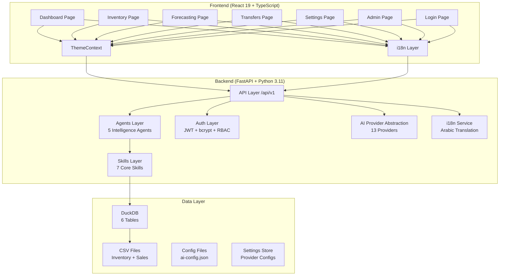

### 4.2 Data Flow (Request -> Decision)

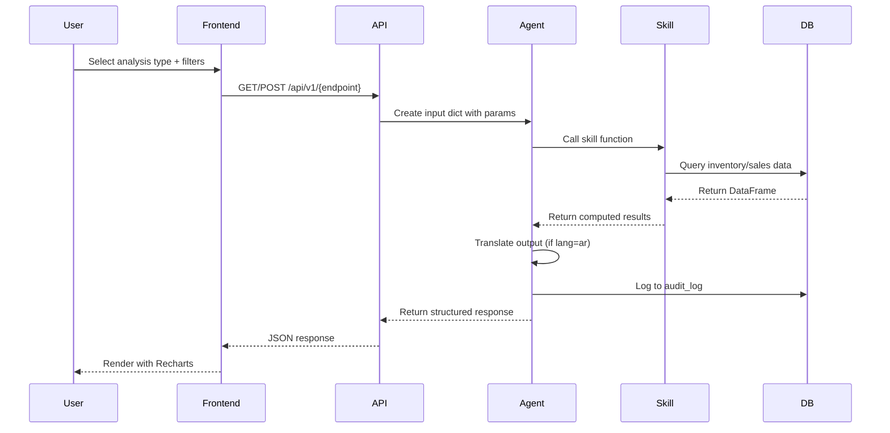

### 4.3 Tech Stack

| Layer | Technology | Version | Purpose |
|-------|-----------|---------|---------|
| Backend Runtime | Python | 3.11+ | Server-side logic |
| Backend Framework | FastAPI | 0.110+ | REST API framework |
| ASGI Server | Uvicorn | 0.30+ | Production-grade server |
| Frontend Framework | React | 19.x | SPA UI |
| Frontend Language | TypeScript | 4.9+ | Type-safe frontend |
| Charts | Recharts | 3.9+ | Data visualization |
| i18n | i18next | 26.x | Internationalization |
| Database | DuckDB | 0.8+ | Embedded columnar DB |
| Data Processing | Pandas | 2.0+ | DataFrame operations |
| Numerical | NumPy | 1.24+ | Linear algebra |
| AI SDK | OpenAI SDK | 1.0+ | AI provider communication |
| Auth | python-jose + bcrypt | latest | JWT + password hashing |
| Encryption | cryptography | 41.0+ | AES-256-GCM |
| HTTP Client | httpx | 0.27+ | Async HTTP calls |
| Container | Docker | latest | Deployment |
| Reverse Proxy | nginx | latest | Frontend hosting |
| CI/CD | GitHub Actions | — | Automated testing |

### 4.4 Current State vs Target State

| Aspect | Current State (v0.9) | Target State (v1.0) |
|--------|---------------------|---------------------|
| Dashboard | 3 KPIs, alerts, insights | + Executive summary, weekly trend |
| Inventory | Stock status classification | + Safety stock, reorder point |
| Forecasting | Linear regression | + Model selection (ARIMA/Prophet) |
| Transfers | Rule-based (source > 4mo, target < 1mo) | + Optimization algorithm |
| AI Insights | Provider abstraction only | Wired for narrative generation |
| Settings | Basic provider config | Full 14-category settings page |
| Theme | CSS variables (light/dark) | + System preference detection |
| Reports | CSV/Excel export | + PDF reports, scheduled reports |
| Testing | 75 backend tests | 130+ backend + 50 frontend tests |
| Security | Basic JWT + bcrypt | + Rate limiting, CORS hardening |

---

## 5. User Personas

### 5.1 Persona Matrix

| Role | System Role | Primary Goal | Pain Point |
|------|-------------|--------------|------------|
| Admin | `admin` | Manage users, configure system | No central config |
| Manager | `manager` | Optimize stock across branches | Manual spreadsheets |
| Analyst | `manager` | Deep-dive into data trends | Limited analytics |
| Viewer | `viewer` | Read-only reports | Too many tools |
| Executive | `viewer` | High-level overview | Data overload |

### 5.2 Detailed Personas

**Persona A — Inventory Manager (Salem)**
- Role: `manager`
- Daily tasks: Monitor stock levels, approve transfers, order replenishment
- Needs: At-a-glance dashboard, automated alerts, transfer recommendations
- Pain: Spends 2+ hours/day in Excel across 3 branches
- Success: Reduce decision time to 15 minutes

**Persona B — Supply Chain Analyst (Nora)**
- Role: `manager`
- Daily tasks: Analyze sales trends, forecast demand, identify slow-movers
- Needs: Forecasting tools, trend analysis, data export
- Pain: No forecasting capability — relies on gut feeling
- Success: Accurate demand predictions

**Persona C — Operations Director (Khalid)**
- Role: `viewer`
- Daily tasks: Review high-level KPIs, approve budgets
- Needs: Executive dashboard, KPI trends, AI-generated summaries
- Pain: Too much data, not enough insight
- Success: 5-minute daily review

**Persona D — System Admin (Ahmed)**
- Role: `admin`
- Daily tasks: Manage users, configure AI providers, monitor system health
- Needs: Full settings control, user management, audit logs
- Pain: Hardcoded configuration
- Success: Point-and-click configuration

---

# Part II — Architecture

---

## 6. Architecture

### 6.1 Frontend Architecture

#### 6.1.1 Component Tree

```
src/
├── index.tsx                     # Entry: ReactDOM.createRoot + ThemeProvider
├── App.tsx                       # Router: 7 routes + navigation + token management
├── i18n.ts                       # i18next init with LanguageDetector
│
├── context/
│   └── ThemeContext.tsx           # Global state: theme (light/dark), lang (en/ar), dir (ltr/rtl)
│
├── components/
│   ├── Layout.tsx                 # Shell: header, theme toggle, lang toggle, settings FAB
│   └── DateRangePicker.tsx        # Reusable date filter
│
├── pages/
│   ├── LoginPage.tsx              # JWT login form
│   ├── DashboardPage.tsx          # KPI cards, bar chart, alerts, insights
│   ├── InventoryPage.tsx          # Table, summary, CRUD modal, status filter
│   ├── ForecastingPage.tsx        # Period selector, forecast table
│   ├── TransfersPage.tsx          # Transfer recommendations table
│   ├── SettingsPage.tsx           # AI provider configuration
│   └── AdminPage.tsx              # User management, system stats
│
├── services/
│   └── providers.ts               # 13 provider definitions + utility functions
│
├── locales/
│   ├── en.json                     # 85 English translation keys
│   └── ar.json                     # 85 Arabic translation keys
│
└── theme/
    └── theme.css                   # CSS custom properties for light + dark
```

#### 6.1.2 Current State

| Aspect | Status | Notes |
|--------|--------|-------|
| Routing | ✅ Done | 7 routes with NavLink |
| Theme/Lang Context | ✅ Done | ThemeContext with localStorage |
| i18n | ✅ Done | 85 keys per locale, LanguageDetector |
| RTL Support | ✅ Done | dir="rtl" switching |
| Layout | ✅ Done | Header with toggles + FAB |
| Dashboard | ✅ Done | KPIs, alerts, chart |
| Inventory | ✅ Done | Table, CRUD, filtering |
| Forecasting | ⚠️ Basic | Period selector, table |
| Transfers | ⚠️ Basic | Recommendations table |
| Settings | ⚠️ Basic | AI provider panel |
| Login | ✅ Done | JWT form |
| Admin | ⚠️ Basic | Users + stats |
| Responsive | ⚠️ Partial | 1024px+ target |
| Error Boundaries | ❌ Missing | Not implemented |
| Skeleton Loading | ❌ Missing | Not implemented |
| Monolithic CSS | ❌ Refactor needed | All in App.css |

#### 6.2.1 Target State

| Feature | Target Implementation |
|---------|----------------------|
| Theme | System preference detection + manual override |
| Navigation | 3-click rule, breadcrumbs, keyboard shortcuts |
| Loading | Skeleton components for all async operations |
| Error | Error boundaries per page, toast notifications |
| Forms | Validation on blur, auto-save, confirmation dialogs |
| Responsive | Full support 320px–1920px |
| Accessibility | WCAG 2.1 AA, ARIA labels, focus management |

### 6.2 Backend Architecture

#### 6.2.1 Directory Structure

```
app/
├── main.py                         # FastAPI app, lifespan, CORS, WebSocket
├── core/
│   ├── config.py                   # Settings: AI provider, encryption, paths
│   └── logging.py                  # JSON structured logging
├── api/
│   ├── __init__.py                 # Router exports
│   ├── api.py                      # 25 REST endpoints
│   └── auth.py                     # 3 auth endpoints
├── services/
│   ├── skills.py                   # 7 core skill functions
│   ├── agents.py                   # 5 intelligence agents
│   ├── ai_provider.py              # AI provider abstraction
│   ├── i18n.py                     # Arabic translation (38 keys)
│   ├── auth.py                     # JWT + bcrypt + RBAC
│   └── notifications.py           # WebSocket + email
├── schemas/
│   ├── auth.py                     # UserCreate, UserResponse, Token, LoginRequest
│   ├── dashboard.py                # KPIItem, AlertItem, InsightItem, DashboardAnalyze
│   ├── data_management.py          # DataQualityIssue, DataStatus, DataStatusResponse
│   ├── forecasting.py              # ForecastItem, ForecastPeriod, ForecastingRun
│   ├── inventory.py                # InventoryItem, InventorySummary, InventoryAlert
│   └── transfers.py                # TransferRecommendation, TransferAlert
└── data/
    ├── db.py                       # DuckDB: 6 tables, CRUD, audit logging
    └── settings_store.py           # 13 provider defaults, load/save/mask/reset
```

#### 6.2.2 API Endpoint Map

```mermaid
graph LR
    subgraph "Dashboard"
        A1[GET /dashboard]
        A2[POST /dashboard/analyze]
    end
    subgraph "Inventory"
        B1[GET /inventory]
        B2[POST /inventory/analyze]
        B3[GET /inventory/products]
        B4[POST /inventory/products]
        B5[PUT /inventory/products/{code}]
        B6[DELETE /inventory/products/{code}]
    end
    subgraph "Forecasting"
        C1[GET /forecasting]
        C2[POST /forecasting/run]
    end
    subgraph "Transfers"
        D1[GET /transfers]
        D2[POST /transfers/analyze]
    end
    subgraph "Data"
        E1[GET /data/status]
        E2[POST /data/reload]
    end
    subgraph "Export"
        F1[GET /export/inventory/csv]
        F2[GET /export/inventory/excel]
    end
    subgraph "Admin"
        G1[GET /admin/users]
        G2[GET /admin/stats]
    end
    subgraph "Settings"
        H1[GET /settings]
        H2[PUT /settings]
        H3[POST /settings/reset-defaults]
        H4[POST /settings/test-connection]
        H5[POST /settings/fetch-models]
    end
    subgraph "Auth"
        I1[POST /auth/signup]
        I2[POST /auth/login]
        I3[GET /auth/me]
    end
    subgraph "System"
        J1[POST /notify/test]
        J2[GET /agents/status]
        J3[GET /health]
    end
```

#### 6.2.3 Current State

| Aspect | Status | Notes |
|--------|--------|-------|
| REST API | ✅ Done | 25 endpoints under /api/v1 |
| Auth | ✅ Done | JWT 24h, bcrypt, 3 roles |
| Skills | ✅ Done | 7 functions |
| Agents | ✅ Done | 5 agents with audit logging |
| DuckDB | ✅ Done | 6 tables, CSV loading |
| Settings Store | ✅ Done | 13 provider configs |
| i18n Backend | ✅ Done | 38 Arabic keys |
| AI Providers | ⚠️ Abstraction done | Not wired to agents |
| Notifications | ⚠️ Basic | WebSocket + email stub |
| Error Handling | ⚠️ Partial | No structured error codes |

### 6.3 AI Layer Architecture

#### 6.3.1 Provider Class Hierarchy

```
BaseAIProvider (abstract)
├── OpenAICompatibleProvider   (OpenAI, OpenRouter, Groq, DeepSeek, Mistral, xAI, Custom)
├── AzureOpenAIProvider        (Azure OpenAI)
└── GeminiProvider             (Google Gemini)
```

**Factory Function:** `get_provider(provider_name: str, config: dict) → BaseAIProvider`

#### 6.3.2 Supported Providers

| # | Provider | Base URL | Auth | Streaming | Status |
|---|----------|----------|------|-----------|--------|
| 1 | OpenAI | `https://api.openai.com/v1` | API Key | ✅ | Implemented |
| 2 | Google Gemini | `https://generativelanguage.googleapis.com` | API Key | ❌ | Implemented |
| 3 | NVIDIA | `https://integrate.api.nvidia.com/v1` | API Key | ❌ | Config defined |
| 4 | OpenRouter | `https://openrouter.ai/api/v1` | API Key | ✅ | Config defined |
| 5 | Ollama | `http://localhost:11434/v1` | None | ✅ | Config defined |
| 6 | LM Studio | `http://localhost:1234/v1` | None | ✅ | Config defined |
| 7 | Anthropic | `https://api.anthropic.com/v1` | API Key | ✅ | Config defined |
| 8 | Groq | `https://api.groq.com/openai/v1` | API Key | ✅ | Config defined |
| 9 | DeepSeek | `https://api.deepseek.com/v1` | API Key | ✅ | Config defined |
| 10 | Mistral | `https://api.mistral.ai/v1` | API Key | ✅ | Config defined |
| 11 | xAI (Grok) | `https://api.x.ai/v1` | API Key | ✅ | Config defined |
| 12 | Azure OpenAI | Custom | API Key + Endpoint | ✅ | Implemented |
| 13 | Custom | User-defined | User-defined | ✅ | Config defined |

#### 6.3.3 Current State vs Target State

| Aspect | Current | Target |
|--------|---------|--------|
| Provider connection | ✅ Implemented | + Connection pooling |
| Model fetching | ✅ Implemented | + Model filtering/search |
| Streaming | ⚠️ Partial | All providers |
| Temperature/params | ✅ Per-provider | + Per-request override |
| Error handling | ⚠️ Basic | + Retry with backoff, circuit breaker |
| Prompt templates | ❌ Not implemented | + Template library |
| Response parsing | ❌ Not implemented | + Structured output parsing |

### 6.4 Data Layer

#### 6.4.1 Database Schema (DuckDB — 6 Tables)

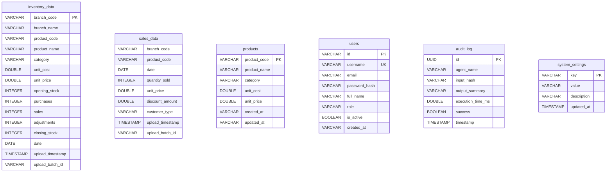

#### 6.4.2 Configuration Storage

| Location | Format | Purpose |
|----------|--------|---------|
| `.env` | Key=Value | OPENAI_API_KEY, GEMINI_API_KEY, DEBUG, DATABASE_URL |
| `config/ai-config.json` | JSON | Active AI provider selection |
| `data/providers.json` | JSON | 13 provider configurations (API keys AES-encrypted) |
| `app/core/config.py` | Python | Settings class with env loading, encryption utilities |
| `app/data/settings_store.py` | Python | Provider config CRUD with masking |

#### 6.4.3 Sample Data

| Dataset | Rows | Products | Branches | Categories | Date Range |
|---------|------|----------|----------|------------|------------|
| Inventory | 25 | 10 | 3 | 4 | 2025-01-01 |
| Sales | 312 | 10 | 3 | 4 | 2025-01-02 to 2025-03-31 |

### 6.5 Dependencies

#### 6.5.1 Backend (Python — requirements.txt)

| Package | Min Version | Purpose |
|---------|-------------|---------|
| fastapi | 0.110.0 | REST framework |
| uvicorn | 0.30.0 | ASGI server |
| python-dotenv | 1.0.0 | Environment loading |
| pydantic | 2.7.0 | Schema validation |
| pandas | 2.0.0 | Data processing |
| duckdb | 0.8.0 | Embedded database |
| numpy | 1.24.0 | Numerical operations |
| openai | 1.0.0 | AI provider SDK |
| google-generativeai | 0.3.0 | Gemini SDK |
| cryptography | 41.0.0 | AES encryption |
| httpx | 0.27.0 | HTTP client |
| python-jose | 3.3.0 | JWT |
| passlib[bcrypt] | 1.7.4 | Password hashing |
| bcrypt | 4.1.3 | BCrypt algorithm |
| python-multipart | 0.0.6 | Form parsing |
| openpyxl | 3.0.0 | Excel export |
| reportlab | 4.0.0 | PDF generation |

#### 6.5.2 Frontend (React — package.json)

| Package | Version | Purpose |
|---------|---------|---------|
| react | 19.x | UI framework |
| react-dom | 19.x | DOM rendering |
| react-router-dom | 6.22 | Client routing |
| recharts | 3.9.2 | Charts |
| i18next | 26.x | i18n engine |
| react-i18next | 17.x | React i18n bindings |
| i18next-browser-languagedetector | 8.x | Auto language detection |
| typescript | 4.9 | Type safety |
| react-scripts | 5.0.1 | Build tooling |

### 6.6 Folder Structure (Complete Reference)

```
TIF-AI/
├── app/                          # Backend (Python FastAPI)
│   ├── __init__.py
│   ├── main.py                   # Entry point
│   ├── api/
│   │   ├── __init__.py
│   │   ├── api.py                # All REST endpoints
│   │   └── auth.py               # Auth routes
│   ├── core/
│   │   ├── __init__.py
│   │   ├── config.py             # Settings + encryption
│   │   └── logging.py            # JSON logging
│   ├── data/
│   │   ├── __init__.py
│   │   ├── db.py                 # DuckDB + CRUD
│   │   └── settings_store.py     # Provider config
│   ├── schemas/
│   │   ├── __init__.py
│   │   ├── auth.py               # User models
│   │   ├── dashboard.py          # KPI/Alert/Insight models
│   │   ├── data_management.py    # Data quality models
│   │   ├── forecasting.py        # Forecast models
│   │   ├── inventory.py          # Inventory models
│   │   └── transfers.py          # Transfer models
│   └── services/
│       ├── __init__.py
│       ├── agents.py             # 5 intelligence agents
│       ├── ai_provider.py        # AI provider abstraction
│       ├── auth.py               # JWT + RBAC
│       ├── i18n.py               # Arabic translations
│       ├── notifications.py      # WebSocket + email
│       └── skills.py             # 7 core skill functions
├── frontend/                     # Frontend (React 19 + TypeScript)
│   ├── package.json
│   ├── tsconfig.json
│   └── src/
│       ├── index.tsx
│       ├── App.tsx
│       ├── i18n.ts
│       ├── components/
│       │   ├── Layout.tsx
│       │   └── DateRangePicker.tsx
│       ├── context/
│       │   └── ThemeContext.tsx
│       ├── locales/
│       │   ├── en.json
│       │   └── ar.json
│       ├── pages/
│       │   ├── AdminPage.tsx
│       │   ├── DashboardPage.tsx
│       │   ├── ForecastingPage.tsx
│       │   ├── InventoryPage.tsx
│       │   ├── LoginPage.tsx
│       │   ├── SettingsPage.tsx
│       │   └── TransfersPage.tsx
│       ├── services/
│       │   └── providers.ts
│       └── theme/
│           └── theme.css
├── cli/                          # CLI tool (Node.js)
│   ├── package.json
│   └── src/
│       └── tif-ai.js             # 25+ commands
├── setup/                        # Setup wizard (Node.js)
│   ├── package.json
│   └── index.js                  # 1142-line wizard
├── data/                         # Data files
│   ├── inventory_data.csv        # Sample inventory (25 rows)
│   ├── sales_data.csv            # Sample sales (312 rows)
│   ├── providers.json            # AI provider configs
│   └── tifai.duckdb             # DuckDB database
├── config/
│   └── ai-config.json            # Active provider selection
├── docs/                         # Documentation
│   ├── agent_protocols.md
│   ├── data_contracts.md
│   ├── feature_parity_matrix.md
│   ├── final_implementation_report.md
│   └── skills_catalog.md
├── skills/                       # Skill markdown docs
│   ├── anomaly_detection.md
│   ├── data_quality.md
│   ├── demand_forecasting.md
│   ├── inventory_analysis.md
│   ├── kpi_calculation.md
│   └── transfer_optimization.md
├── tests/                        # Backend tests
│   ├── conftest.py
│   ├── test_agents.py
│   ├── test_api.py
│   ├── test_auth.py
│   ├── test_db.py
│   ├── test_schemas.py
│   └── test_skills.py
├── Dockerfile.backend
├── Dockerfile.frontend
├── docker-compose.yml
├── nginx.conf
├── requirements.txt
├── .env.example
├── .github/workflows/ci.yml
└── README.md
```

---

# Part III — Business Logic

---

## 7. Business Logic

> **Note:** This section is the authoritative reference for all business formulas, thresholds, and decision rules. Any discrepancy between this and other documents should be resolved in favor of this section.

### 7.1 Sales Analysis

#### 7.1.1 Current Implementation

| Analysis | Formula | Status |
|----------|---------|--------|
| Daily Sales Aggregation | `SUM(quantity_sold) GROUP BY date` | ✅ Implemented |
| Sales by Product | `SUM(quantity_sold) GROUP BY product_code` | ✅ Implemented |
| Sales by Branch | `SUM(quantity_sold) GROUP BY branch_code` | ✅ Implemented |
| Sales by Category | `SUM(quantity_sold) GROUP BY category` (via join) | ✅ Implemented |

#### 7.1.2 Anomaly Detection

```mermaid
flowchart LR
    A[Daily Sales Data] --> B[Calculate Mean]
    A --> C[Calculate Std Dev]
    B & C --> D[Compute Z-Score]
    D --> E{|z| >= 2.5?}
    E -->|Yes| F[Flag as ANOMALY]
    E -->|No| G[Normal]
    F --> H{Severity}
    H -->|2.5 <= z < 3.0| I[MEDIUM]
    H -->|z >= 3.0| J[HIGH]
```

**Formula:**
```
z = |value - mean| / std
Anomaly if |z| >= 2.5
Severity MEDIUM if 2.5 <= |z| < 3.0
Severity HIGH if |z| >= 3.0
```

**Location:** `skills.py:56-80`

#### 7.1.3 Target State (v1.0)

| Analysis | Formula | Priority |
|----------|---------|----------|
| Growth Rate | `((Current - Previous) / Previous) × 100` | High |
| Sales Trend | Linear regression of monthly totals | Medium |
| Seasonality Index | Monthly average / overall average | Medium |
| Best/Worst Sellers | Top/bottom N products by revenue | High |
| Contribution Analysis | Product revenue / total revenue × 100 | High |
| Customer Type Breakdown | Sales by customer_type segment | Low |

### 7.2 Inventory Analysis

#### 7.2.1 Stock Status Classification

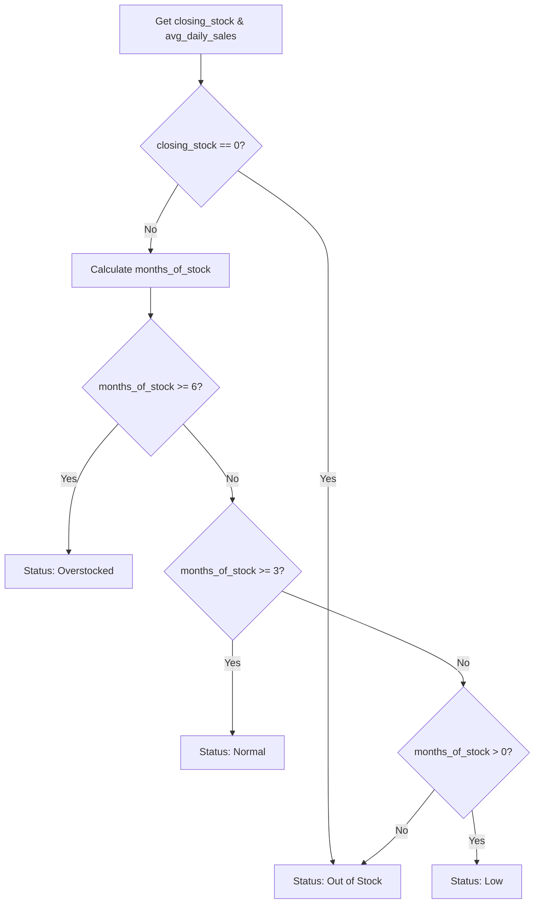

**Core Formula:**
```
avg_daily_sales = total_sales / date_range_days
months_of_stock = closing_stock / max(avg_daily_sales, 0.01) / 30
```

**Classification Thresholds:**

| Status | Condition | Color | Action Required |
|--------|-----------|-------|-----------------|
| Overstocked | months_of_stock >= 6 | 🟠 Orange | Consider promotion/transfer |
| Normal | 3 <= months_of_stock < 6 | 🟢 Green | Monitor |
| Low | 0 < months_of_stock < 3 | 🟡 Yellow | Reorder soon |
| Out of Stock | closing_stock == 0 | 🔴 Red | Urgent reorder |

**Edge Cases:**
- Zero sales history → `avg_daily_sales = 0.01` (prevents division by zero)
- Products with no sales appear overstocked (known limitation)

#### 7.2.2 KPI Calculations

| KPI | Formula | Unit | Source |
|-----|---------|------|--------|
| Total Sales Quantity | `SUM(quantity_sold)` | Units | `skills.py:17` |
| Total Inventory Value | `SUM(closing_stock × unit_cost)` | SAR | `skills.py:25` |
| Inventory Turnover | `COGS / avg_inventory_value` | Ratio | `skills.py:42-43` |
| Avg Inventory Value | `AVG(opening_stock + closing_stock) / 2 × unit_cost` | SAR | `skills.py:40` |
| COGS (approximated) | `AVG(unit_cost) × SUM(quantity_sold)` | SAR | `skills.py:42` |

**Trend Calculation:** Currently hardcoded to `"stable"` for all KPIs. Target state will calculate actual trend from historical data.

#### 7.2.3 Inventory Metrics

| Metric | Formula |
|--------|---------|
| Total Products | `COUNT(DISTINCT product_code)` |
| Total Stock Value | `SUM(closing_stock × unit_cost)` |
| Total Items | `SUM(closing_stock)` |
| Overstocked Count | `COUNT WHERE months_of_stock >= 6` |
| Low Stock Count | `COUNT WHERE 0 < months_of_stock < 3` |
| Out of Stock Count | `COUNT WHERE closing_stock == 0` |

#### 7.2.4 Target State (v1.0 — Advanced Models)

```mermaid
flowchart TD
    subgraph "Future Inventory Models"
        A[ABC Analysis]
        B[XYZ Analysis]
        C[FSN Analysis]
        D[Safety Stock]
        E[Reorder Point]
        F[EOQ]
    end
    
    A --> G[Class A: 70% value<br/>Class B: 20% value<br/>Class C: 10% value]
    B --> H[X: CV < 0.5<br/>Y: 0.5 <= CV <= 1.0<br/>Z: CV > 1.0]
    C --> I[F: Fast-moving<br/>S: Slow-moving<br/>N: Non-moving]
    D --> J[SS = Z × σ_demand × √LT]
    E --> K[ROP = d_avg × LT + SS]
    F --> L[EOQ = √(2DS / H)]
```

### 7.3 Demand Forecasting

#### 7.3.1 Current Implementation (Linear Regression)

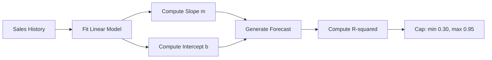

**Formulas:**
```
m = (nΣxy - ΣxΣy) / (nΣx² - (Σx)²)     # Slope
b = (Σy - mΣx) / n                       # Intercept
y = m × future_period + b                # Forecast value
R² = 1 - (SSres / SStot)                 # Confidence
confidence = max(0.30, min(0.95, R²))    # Capped confidence
```

**Parameters:**

| Parameter | Default | Range | Description |
|-----------|---------|-------|-------------|
| `period_days` | 30 | 1–365 | Forecast horizon |
| `min_history_days` | 2 | 2–365 | Minimum data required |

**Edge Cases:**

| Scenario | Behavior |
|----------|----------|
| Zero sales history | `avg_daily_sales = 0.01` fallback |
| Single data point | Empty forecast returned |
| Identical sales (σ = 0) | Slope = 0, constant forecast |
| Negative forecast | Passed as-is (not clamped) |

#### 7.3.2 Target State: Advanced Forecasting

```mermaid
flowchart TD
    subgraph "Target: Multi-Model Forecast"
        A[Input Data] --> B{Data Volume?}
        B -->|>= 30 periods| C[ARIMA]
        B -->|>= 2 seasons| D[Seasonal ARIMA]
        B -->|Has outliers| E[Prophet]
        B -->|>= 100 records multi-feature| F[XGBoost]
        B -->|>= 1000 records| G[LSTM]
        B -->|Default| H[Ensemble (avg of 3)]
    end
    C & D & E & F & G & H --> I[Model Selection Logic]
    I --> J[Best Fit Forecast]
```

### 7.4 Recommendation Engine

#### 7.4.1 Transfer Recommendations

**Trigger Condition (Rule-based):**
```
IF source_branch.months_of_stock > 4
AND target_branch.months_of_stock < 1
THEN recommend_transfer(source → target)
```

**Quantity Calculation:**
```
surplus = source_closing - (avg_daily_sales_source × 30 × 2)
shortfall = (avg_daily_sales_target × 30 × 2) - target_closing
quantity = min(surplus, shortfall)
```

**Priority Assignment:**
```
IF target.months_of_stock < 0.5 → priority = HIGH
ELSE IF target.months_of_stock < 1.0 → priority = MEDIUM
```

**Output Fields:**

| Field | Description |
|-------|-------------|
| `product_code` | Product to transfer |
| `product_name` | Human-readable name |
| `from_branch` | Source branch (surplus) |
| `to_branch` | Target branch (deficit) |
| `quantity` | Recommended transfer quantity |
| `reason` | Arabic/English localized explanation |
| `priority` | HIGH / MEDIUM / LOW |

#### 7.4.2 Target State: Advanced Recommendations

| Recommendation | Trigger | Priority |
|----------------|---------|----------|
| Purchase Order | months_of_stock < reorder_threshold | High |
| Markdown Alert | months_of_stock > overstock_threshold × 2 | High |
| Clearance Alert | months_of_stock > 12 AND slow_mover | Medium |
| Bundle Suggest | slow_mover AND related surplus | Low |
| Supplier Return | months_of_stock > 12 AND no recent sales | Low |

### 7.5 AI Logic

#### 7.5.1 Current State

- Provider abstraction layer exists (`BaseAIProvider`)
- 3 concrete providers: OpenAICompatible, AzureOpenAI, Gemini
- Factory function: `get_provider(provider_name, config)`
- **Not yet wired** to agents for narrative generation
- Insights are template-based (hardcoded strings in `i18n.py`)

#### 7.5.2 Target State: Prompt Architecture

**System Prompt Template:**
```
You are an inventory analysis assistant for a retail business.
Analyze the following KPI data and provide insights.
Language: {language} (ar_SA or en_US)
Tone: Professional, data-driven
Output: JSON with keys: summary, insights[], recommendations[]
```

**Context Injection:**
```
Current KPIs:
- Total Inventory Value: {value}
- Turnover Ratio: {ratio}
- Months of Stock: {months}
- Active Products: {count}
```

**Response Parsing Rules:**
1. Strip markdown code fences
2. Validate JSON structure
3. Verify required keys (`summary`, `insights`, `recommendations`)
4. Fallback to template text on parse failure

### 7.6 Decision Engine

#### 7.6.1 Agent Architecture

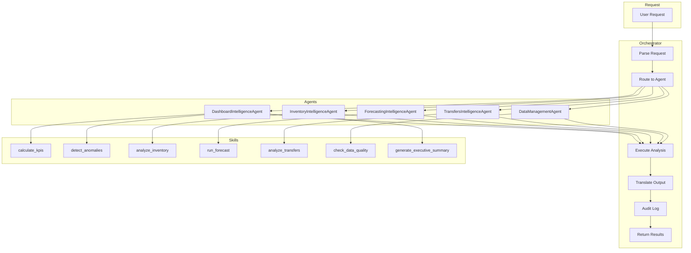

#### 7.6.2 Agent Specification

| Agent | Skill Function(s) | Output Type | Input Params |
|-------|------------------|-------------|--------------|
| Dashboard | `calculate_kpis`, `detect_anomalies`, `generate_executive_summary` | `DashboardAnalyzeResponse` | branch_id, date_range, category, product_id |
| Inventory | `analyze_inventory` | `InventoryAnalyzeResponse` | branch_id, category |
| Forecasting | `run_forecast` | `ForecastingRunResponse` | branch_id, category, period_days |
| Transfers | `analyze_transfers` | `TransfersAnalyzeResponse` | branch_id |
| Data Management | `check_data_quality` | `DataStatusResponse` | None |

#### 7.6.3 Execution Pipeline

```
1. Parse Request → Extract lang, params, analysis type
2. Route → Map analysis type to agent class
3. Execute → agent.analyze(input_dict) → calls skill function
4. Translate → _translate_output(result, lang) via i18n.t()
5. Audit → log_agent_invocation() to audit_log table
6. Return → Structured response with generated_at, agent, execution_time_ms
```

**Parallel Execution:** Inventory agent uses `ThreadPoolExecutor` to process branches concurrently.

### 7.7 Data Validation & Quality

#### 7.7.1 Validation Rules (V01–V10)

| ID | Check | Condition | Severity | Scope |
|----|-------|-----------|----------|-------|
| V01 | Empty DataFrame | `df.empty` | ERROR | All |
| V02 | Required Columns | Missing `product_code`/`date`/`quantity_sold` | ERROR | Sales |
| V03 | Required Columns | Missing `product_code`/`closing_stock`/`unit_cost` | ERROR | Inventory |
| V04 | Negative Stock | `closing_stock < 0` | WARNING | Inventory |
| V05 | Negative Price | `unit_cost < 0` or `unit_price < 0` | WARNING | Both |
| V06 | Discount > Price | `discount_amount > unit_price` | WARNING | Sales |
| V07 | Future Dates | `date > today` | WARNING | Both |
| V08 | Duplicate Rows | Duplicate `(product_code, date, branch_code)` | WARNING | Both |
| V09 | Null Values | Any required field is NULL | ERROR | Both |
| V10 | Zero Stock with Sales | `closing_stock = 0` but sales > 0 | INFO | Inventory |

#### 7.7.2 Data Cleaning Rules

| ID | Rule | Action | Phase |
|----|------|--------|-------|
| C01 | Remove duplicates | `df.drop_duplicates(subset=[...], keep='last')` | Current |
| C02 | Filter future dates | `df[df.date <= today]` | Current |
| C03 | Negative values flag | Add to quality issues report | Current |
| C04 | Fill missing categories | Infer from product master | Phase 3 |
| C05 | Normalize product codes | Uppercase, strip whitespace | Phase 3 |
| C06 | Validate branch codes | Against known branch list | Phase 3 |

### 7.8 Business Rules Reference (BR01–BR28)

| ID | Rule | Condition | Result | Priority |
|----|------|-----------|--------|----------|
| BR01 | Stock Status | months_of_stock >= 6 | Status = "overstocked" | P0 |
| BR02 | Stock Status | 3 <= months_of_stock < 6 | Status = "normal" | P0 |
| BR03 | Stock Status | 0 < months_of_stock < 3 | Status = "low" | P0 |
| BR04 | Stock Status | closing_stock == 0 | Status = "out_of_stock" | P0 |
| BR05 | Transfer | source > 4mo AND target < 1mo | Recommend transfer | P0 |
| BR06 | Anomaly | \|z\| >= 2.5 | Flag anomaly | P0 |
| BR07 | Anomaly Severity | \|z\| >= 3.0 | Severity = HIGH | P0 |
| BR08 | Anomaly Severity | 2.5 <= \|z\| < 3.0 | Severity = MEDIUM | P0 |
| BR09 | Forecast Confidence | R² > 0.95 | Cap at 0.95 | P0 |
| BR10 | Forecast Confidence | R² < 0.30 | Floor at 0.30 | P0 |
| BR11 | Zero Sales | avg_daily_sales == 0 | Use 0.01 fallback | P0 |
| BR12 | Transfer Priority | target < 0.5mo | Priority = HIGH | P0 |
| BR13 | Transfer Priority | 0.5 <= target < 1.0mo | Priority = MEDIUM | P0 |
| BR14 | Low Turnover | inventory_turns < 2 | Generate low-turnover insight | P1 |
| BR15 | Healthy Turnover | inventory_turns >= 2 | Generate healthy insight | P1 |
| BR16–BR28 | (Future rules) | — | — | P2–P4 |

---

# Part IV — UI/UX

---

## 8. UI / UX

### 8.1 Page Inventory

| # | Page | Route | Current State | Target State |
|---|------|-------|---------------|--------------|
| 1 | Login | `/login` | ✅ Complete | + Social auth |
| 2 | Dashboard | `/dashboard` | ✅ Functional | + Executive summary |
| 3 | Inventory | `/inventory` | ✅ Functional | + Advanced filters |
| 4 | Forecasting | `/forecasting` | ⚠️ Basic | + Model selector |
| 5 | Transfers | `/transfers` | ⚠️ Basic | + Map view |
| 6 | Settings | `/settings` | ⚠️ Basic | + 14 categories |
| 7 | Admin | `/admin` | ⚠️ Basic | + Full user management |
| 8 | Upload | `/upload` | ❌ Planned | + CSV/API import |
| 9 | Reports | `/reports` | ❌ Planned | + PDF generator |
| 10 | AI Chat | `/ai-chat` | ❌ Planned | + RAG-powered chat |
| 11 | Backup | `/backup` | ❌ Planned | + Full backup mgmt |
| 12 | Workspace | `/workspace` | ❌ Planned | + Multi-workspace |

### 8.2 Dashboard Page

**Purpose:** Central command center — all KPIs, alerts, and insights in one view.

```
┌──────────────────────────────────────────────────────────────┐
│  TIF-AI  │  Dashboard  Inventory  Forecasting  ...  ⚙️  🌙  │
├──────────────────────────────────────────────────────────────┤
│  📅 [Start Date] ─ [End Date]  ├──  [All Branches] ▼        │
│                                                              │
│  ┌──────────┐  ┌──────────┐  ┌──────────┐  ┌──────────┐     │
│  │ Sales Qty │  │ Inv Value│  │ Turnover │  │ Products  │    │
│  │  12,450  │  │ 525,000 │  │   3.2    │  │    145    │     │
│  │  ▲ 12%   │  │  ▼ 3%    │  │  Stable  │  │  Active   │    │
│  └──────────┘  └──────────┘  └──────────┘  └──────────┘     │
│                                                              │
│  ┌────────────────────────────────────────────────────┐      │
│  │  📊 Sales Trend (Last 30 Days)                     │      │
│  │  ┌──────────────────────────────────────────────┐  │      │
│  │  │           ▁▃▆█▇▆▅▃▁▂▄▆█▇▆▅▃▁               │  │      │
│  │  │           ██████████████████████               │  │      │
│  │  └──────────────────────────────────────────────┘  │      │
│  │  [1w] [1m] [3m] [All]                              │      │
│  └────────────────────────────────────────────────────┘      │
│                                                              │
│  ┌────────────────────┐  ┌────────────────────────────────┐  │
│  │  🔴 Alerts (3)     │  │  💡 Insights                   │  │
│  │────────────────────│  │────────────────────────────────  │  │
│  │ • Out of Stock: 2  │  │ • Low turnover in Electronics  │  │
│  │ • Overstocked: 5   │  │ • Ramadan spike predicted      │  │
│  │ • Anomaly: Jul 5   │  │ • Jeddah needs replenishment   │  │
│  └────────────────────┘  └────────────────────────────────┘  │
└──────────────────────────────────────────────────────────────┘
```

**Elements:**

| Zone | Element | Description |
|------|---------|-------------|
| Top | Header | Logo, nav, theme/lang toggles, settings FAB |
| Top | Filter Bar | Date range picker, branch/category/product dropdowns |
| Grid | KPI Cards | 4 metric cards with trend indicators |
| Chart | Sales Trend | Bar/line chart with time range selector |
| Side | Alerts Panel | Prioritized alert list with severity colors |
| Side | Insights Panel | AI-generated (or templated) insights |

**User Journey:**
1. User arrives → sees 4 KPI cards with current period data
2. Adjusts date filter → all views update simultaneously
3. Hovers over chart → sees tooltip with exact values
4. Clicks alert → navigates to relevant page (inventory, transfers)
5. Clicks insight → opens detail panel with recommended action

### 8.3 Upload Page (Proposed)

**Purpose:** Import inventory and sales data from CSV files with validation.

```
┌──────────────────────────────────────────────────────────────┐
│  Upload Data                                                 │
├──────────────────────────────────────────────────────────────┤
│  ┌────────────────────────────────────────────────────────┐  │
│  │  📁 Drop CSV files here or click to browse             │  │
│  │                                                        │  │
│  │  [ Supported: .csv | Max: 10MB | UTF-8 ]              │  │
│  └────────────────────────────────────────────────────────┘  │
│                                                              │
│  ┌────────────────────┬────────────────────┐                 │
│  │ Inventory CSV      │ Sales CSV          │                 │
│  │ ✅ Validated       │ ❌ Error: 3 rows   │                 │
│  │ 25 rows, 15 cols   │ 312 rows, 9 cols   │                 │
│  ├────────────────────┴────────────────────┤                 │
│  │  Data Quality Report:                   │                 │
│  │  • ✅ Required columns present          │                 │
│  │  • ⚠️ 3 negative discount amounts      │                 │
│  │  • ✅ No duplicates found               │                 │
│  └────────────────────────────────────────────────────────┘  │
│                                                              │
│  [Load into Database]                                        │
└──────────────────────────────────────────────────────────────┘
```

**Validation Rules:**
1. File format: CSV only (no Excel, no JSON)
2. Encoding: UTF-8 required
3. Max file size: 10MB
4. Required columns verified against schema
5. Data types validated per column
6. Quality report generated before import
7. Existing data is replaced (not merged)

### 8.4 Analysis Page (Proposed)

**Purpose:** Deep-dive analysis with tabbed views.

```
┌──────────────────────────────────────────────────────────────┐
│  Analysis                                                    │
├──────────────────────────────────────────────────────────────┤
│  [All Branches ▼]  [All Categories ▼]  [Q2 2025 ▼]  [Analyze] │
│                                                              │
│  ┌──────────┬──────────┬──────────┬──────────┐               │
│  │ Summary  │ Details  │ AI Insights │ Export  │               │
│  ├──────────┴──────────┴──────────┴──────────┤               │
│  │                                            │               │
│  │ [Active Tab Content]                      │               │
│  │                                            │               │
│  └────────────────────────────────────────────┘               │
└──────────────────────────────────────────────────────────────┘
```

### 8.5 Reports Page (Proposed)

**Purpose:** Generate, view, and schedule professional reports.

| Feature | Description |
|---------|-------------|
| Report List | Cards showing saved reports with date, type, status |
| Generate New | Form: report type, date range, format (PDF/CSV/Excel) |
| Schedule | Cron-like scheduling for automated reports |
| Templates | Pre-built templates (Weekly Summary, Monthly Deep-Dive) |
| Share | Email report directly from app |

### 8.6 AI Chat Page (Proposed)

**Purpose:** Natural language interaction with inventory data.

```
┌──────────────────────────────────────────────────────────────┐
│  AI Assistant                                                │
├──────────────────────────────────────────────────────────────┤
│  ┌────────────────────────────────────────────────────────┐  │
│  │  AI: Welcome! Ask me anything about your inventory.    │  │
│  │                                                        │  │
│  │  You: Which products are overstocked in Jeddah?        │  │
│  │                                                        │  │
│  │  AI: In Jeddah branch, 3 products are overstocked:     │  │
│  │  • PROD005 (Cooking Oil) - 13.3 months supply          │  │
│  │  • PROD002 (Office Chair) - 8.5 months supply          │  │
│  │  • PROD009 (Notebooks) - 7.2 months supply             │  │
│  │                                                        │  │
│  │  Would you like me to recommend transfers?              │  │
│  └────────────────────────────────────────────────────────┘  │
│                                                              │
│  ┌──────────────────────────────────────────────────────┐    │
│  │  [Type your question here...]  [📎]  [➤]            │    │
│  └──────────────────────────────────────────────────────┘    │
└──────────────────────────────────────────────────────────────┘
```

**Capabilities:**
- Natural language to SQL query translation
- Context-aware follow-up questions
- Data visualization requests ("Show me a chart of...")
- Export chat as report

### 8.7 Settings Page

See [Section 10 — Settings Specification](#10-settings-specification) for full specification.

### 8.8 Workspace Page (Proposed)

**Purpose:** Multi-workspace management for different teams/branches.

| Feature | Description |
|---------|-------------|
| Workspace List | Cards with name, members, data sources |
| Create Workspace | Name, description, member invitation |
| Data Isolation | Each workspace has its own DuckDB database |
| Switch Workspace | Quick switcher in header |

### 8.9 About Page (Proposed)

**Purpose:** System information, version, license, and support.

| Section | Content |
|---------|---------|
| System Info | Version, build date, uptime, Python/Node versions |
| License | License type, expiry, authorized users |
| Support | Contact info, documentation links, issue tracker |
| Credits | Technology stack, contributors |
| System Health | Database status, AI provider status, last backup |

---

# Part V — Design System

---

## 9. Design System

### 9.1 Design Philosophy

**"Enterprise Data-First, Bilingual by Default"**

Core tenets:
1. **Clarity over creativity** — Data is the hero, decoration is minimal
2. **Consistency across languages** — Same experience in Arabic and English
3. **Performance as a feature** — Sub-100ms interactions
4. **Accessibility is non-negotiable** — WCAG 2.1 AA minimum
5. **Progressive disclosure** — Show what's needed, hide the rest
6. **Feedback everywhere** — Every action has a visible response

### 9.2 Color System

#### 9.2.1 Semantic Palette

| Token | Light | Dark | Usage |
|-------|-------|------|-------|
| `--color-primary` | `#0D6EFD` | `#6EA8FE` | Buttons, links, active states |
| `--color-primary-hover` | `#0B5ED7` | `#8BB9FE` | Button hover |
| `--color-secondary` | `#6C757D` | `#ADB5BD` | Secondary actions |
| `--color-success` | `#198754` | `#75B798` | In-stock, positive trends |
| `--color-warning` | `#FFC107` | `#FFDA6A` | Low stock, medium alerts |
| `--color-danger` | `#DC3545` | `#EA868F` | Out-of-stock, critical alerts |
| `--color-info` | `#0DCAF0` | `#6EDFF6` | Tips, help text |
| `--color-bg` | `#FFFFFF` | `#212529` | Page background |
| `--color-surface` | `#F8F9FA` | `#343A40` | Card/panel background |

#### 9.2.2 Status Mapping

| Status | Color | Icon | Background |
|--------|-------|------|------------|
| Overstocked | `#FFC107` | 📦 | `rgba(255,193,7,0.1)` |
| Normal | `#198754` | ✅ | `rgba(25,135,84,0.1)` |
| Low Stock | `#FFC107` | ⚠️ | `rgba(255,193,7,0.1)` |
| Out of Stock | `#DC3545` | 🚫 | `rgba(220,53,69,0.1)` |
| Anomaly | `#DC3545` | 🔥 | `rgba(220,53,69,0.1)` |
| Trend Up | `#198754` | ▲ | — |
| Trend Down | `#DC3545` | ▼ | — |
| Trend Stable | `#6C757D` | ◆ | — |

### 9.3 Typography

#### 9.3.1 Font Stacks

| Usage | Font Family |
|-------|-------------|
| English UI | `Inter, -apple-system, BlinkMacSystemFont, "Segoe UI", sans-serif` |
| Arabic UI | `"Tajawal", "Noto Kufi Arabic", "Segoe UI", sans-serif` |
| Numeric | `"JetBrains Mono", "Cascadia Code", monospace` |
| Code | `"JetBrains Mono", "Fira Code", "Consolas", monospace` |

#### 9.3.2 Type Scale

| Token | Size | Weight | Line Height | Usage |
|-------|------|--------|-------------|-------|
| `--fs-xs` | 11px | 400 | 1.4 | Captions, labels |
| `--fs-sm` | 12px | 400/500 | 1.4 | Table cells, metadata |
| `--fs-base` | 14px | 400 | 1.5 | Body text |
| `--fs-md` | 16px | 500 | 1.5 | Card titles, form labels |
| `--fs-lg` | 18px | 600 | 1.3 | Section headings |
| `--fs-xl` | 24px | 600 | 1.3 | Page titles |
| `--fs-2xl` | 32px | 700 | 1.2 | Hero, KPI values |

### 9.4 Spacing System

**Base grid:** 4px

| Token | Value | Usage |
|-------|-------|-------|
| `--space-1` | 4px | Padding inside compact elements |
| `--space-2` | 8px | Between related elements |
| `--space-3` | 12px | Inside buttons, form fields |
| `--space-4` | 16px | Between cards in a grid |
| `--space-5` | 20px | Section spacing |
| `--space-6` | 24px | Panel padding |
| `--space-8` | 32px | Between major sections |
| `--space-10` | 40px | Page padding |
| `--space-12` | 48px | Modal padding |
| `--space-16` | 64px | Hero spacing |

### 9.5 Border Radius & Shadows

| Token | Value | Usage |
|-------|-------|-------|
| `--radius-sm` | 4px | Input fields, compact cards |
| `--radius-md` | 8px | Cards, modals, dropdowns |
| `--radius-lg` | 12px | Large panels, dialogs |
| `--radius-xl` | 16px | Hero sections |
| `--radius-full` | 9999px | Badges, avatars |
| `--shadow-sm` | `0 1px 2px rgba(0,0,0,0.05)` | Subtle elevation |
| `--shadow-md` | `0 4px 6px rgba(0,0,0,0.07)` | Card elevation |
| `--shadow-lg` | `0 10px 15px rgba(0,0,0,0.1)` | Modal elevation |
| `--shadow-xl` | `0 20px 25px rgba(0,0,0,0.15)` | Toast, tooltip |
| `--shadow-focus` | `0 0 0 3px rgba(13,110,253,0.25)` | Focus ring |

### 9.6 Icons

**Library:** Lucide Icons (primary), inline SVGs for custom shapes

| Size | Token | Usage |
|------|-------|-------|
| 12px | `--icon-xs` | Inline with small text |
| 16px | `--icon-sm` | Inline with body text |
| 20px | `--icon-md` | Button icons |
| 24px | `--icon-lg` | Navigation, status indicators |
| 32px | `--icon-xl` | Empty states |
| 48px | `--icon-2xl` | Page hero icons |

### 9.7 Component Library

#### 9.7.1 Buttons

| Variant | Background | Text | Border | Usage |
|---------|------------|------|--------|-------|
| Primary | `--color-primary` | White | None | Main actions |
| Secondary | `--color-secondary` | White | None | Alternative actions |
| Outline | Transparent | `--color-primary` | `1px solid` | Less prominent |
| Ghost | Transparent | `--color-text` | None | Toolbar actions |
| Danger | `--color-danger` | White | None | Destructive actions |

**Sizes:** sm (28px), md (36px), lg (44px)

#### 9.7.2 Cards

| Variant | Usage | Features |
|---------|-------|----------|
| KPI Card | Dashboard metrics | Left accent bar, trend indicator |
| Summary Card | Stats overview | Header, value, subtitle |
| Detail Card | Item details | Full content, actions |
| Alert Card | Notifications | Severity bar, icon, message |
| Empty Card | No data state | Illustration, message, CTA |

#### 9.7.3 Tables

| Feature | Specification |
|---------|---------------|
| Header | Sticky, sortable columns |
| Row Hover | `background: rgba(13,110,253,0.04)` |
| Row Striping | Alternating `--color-surface` |
| Selection | Checkbox column |
| Pagination | Page numbers + page size selector |
| Empty State | "No data" message with icon |
| Loading | Skeleton rows (3 shimmer lines) |
| Responsive | Horizontal scroll on mobile |

#### 9.7.4 Form Controls

| Control | Spec |
|---------|------|
| Text Field | Height 36px, border 1px, focus ring, error state |
| Select | Same as Text Field + dropdown chevron |
| Toggle | 44px × 24px, active = primary color |
| Checkbox | 18px × 18px, square with rounded corners |
| Date Picker | Two inputs (start/end) with calendar popover |
| File Upload | Drop zone with drag-and-drop, file preview |

#### 9.7.5 Feedback Components

| Component | Trigger | Duration | Content |
|-----------|---------|----------|---------|
| Toast | After async action | 4–6s auto-dismiss | Icon + message + optional undo |
| Alert Banner | System-level issue | Persistent | Severity bar + message + dismiss |
| Modal/Dialog | User action required | Until dismissed | Title + content + actions |
| Skeleton | Content loading | Until loaded | Animated shimmer placeholder |
| Progress Bar | Long operation | Until complete | Percentage + label |

### 9.8 RTL / LTR Rules

| Element | LTR | RTL |
|---------|-----|-----|
| Text align | left | right |
| Direction | `ltr` | `rtl` |
| Padding | `padding-left` for indentation | `padding-right` |
| Icons before text | `margin-right: 8px` | `margin-left: 8px` |
| Chevron in dropdown | Rotate 0° | Rotate 180° |
| Arrow in back button | ← | → |
| Card accent bar | Left border | Right border |
| Table sort indicator | Right of column name | Left of column name |

### 9.9 Responsive Breakpoints

| Breakpoint | Min Width | Target | Behavior |
|------------|-----------|--------|----------|
| Mobile | 0 | 320px | Single column, hamburger menu |
| Tablet | 768px | 768px | 2-column grid, visible nav |
| Desktop | 1024px | 1024px | Full layout, sidebar nav |
| Wide | 1440px | 1440px | Max-width container, side panels |
| Full HD | 1920px | 1920px | Optimal spacing, large charts |

### 9.10 Accessibility

**WCAG 2.1 AA Compliance:**

| Criterion | Target | Implementation |
|-----------|--------|----------------|
| 1.4.3 Contrast (AA) | 4.5:1 text, 3:1 UI | Color tokens verified |
| 1.4.4 Resize Text | 200% without loss | Relative units only |
| 2.1.1 Keyboard | All functions | Full keyboard navigation |
| 2.4.3 Focus Order | Logical sequence | Tab index management |
| 2.4.7 Focus Visible | Clear indicator | 3px focus ring |
| 3.3.2 Labels | Every input | Associated `<label>` elements |
| 4.1.2 ARIA | Dynamic content | ARIA live regions for updates |

**Keyboard Shortcuts:**

| Shortcut | Action |
|----------|--------|
| `Ctrl+K` | Command palette |
| `Ctrl+D` | Dashboard |
| `Ctrl+I` | Inventory |
| `Ctrl+F` | Forecasting |
| `Ctrl+T` | Transfers |
| `Ctrl+S` | Settings |
| `Ctrl+/` | Keyboard shortcuts help |
| `Escape` | Close modal/dropdown |
| `?` | Show help tooltip |

### 9.11 Animations

| Animation | Duration | Easing | Usage |
|-----------|----------|--------|-------|
| Fade In | 200ms | ease-out | Page transitions |
| Slide Up | 300ms | ease-out | Modal/dialog appear |
| Slide Down | 200ms | ease-in | Dropdown appear |
| Scale In | 150ms | ease-out | Tooltip appear |
| Spin | 1s | linear (infinite) | Loading spinner |
| Shimmer | 1.5s | linear (infinite) | Skeleton loading |
| Pulse | 2s | ease-in-out (infinite) | Notification dot |

---

# Part VI — Settings Specification

---

## 10. Settings Specification

### 10.1 Settings Categories

| # | Category | Key Prefix | Status |
|---|----------|------------|--------|
| 1 | General | `general` | Proposed |
| 2 | Appearance | `appearance` | Proposed |
| 3 | Language | `language` | Current |
| 4 | Theme | `theme` | Current |
| 5 | AI Providers | `ai_providers` | Current |
| 6 | Analysis | `analysis` | Proposed |
| 7 | Reports | `reports` | Proposed |
| 8 | Notifications | `notifications` | Proposed |
| 9 | Performance | `performance` | Proposed |
| 10 | Security | `security` | Proposed |
| 11 | Backup & Restore | `backup` | Proposed |
| 12 | Workspace | `workspace` | Proposed |
| 13 | Advanced | `advanced` | Proposed |
| 14 | About | `about` | Proposed |

### 10.2 Settings Detail

#### 10.2.1 General

| Setting | Type | Default | Description | Validation |
|---------|------|---------|-------------|------------|
| Application Name | text | "TIF-AI" | Custom app name | 3–50 chars |
| Timezone | select | "Asia/Riyadh" | Report timestamps | Valid tz database |
| Date Format | select | "YYYY-MM-DD" | Date display | Predefined formats |
| Number Format | select | "#,##0.00" | Number display | Predefined formats |
| Currency | select | "SAR" | Currency symbol | Predefined list |
| First Day of Week | select | "Saturday" | Week start for reports | Sat/Sun/Mon |

#### 10.2.2 Appearance

| Setting | Type | Default | Description | Validation |
|---------|------|---------|-------------|------------|
| Compact Mode | toggle | false | Reduce spacing | — |
| Dense Tables | toggle | false | Smaller table rows | — |
| Show Animations | toggle | true | Enable motion | — |
| Reduced Motion | toggle | false | Respect OS setting | — |
| Card Density | select | "comfortable" | Card spacing | comfortable/compact |

#### 10.2.3 Language (Current)

| Setting | Type | Default | Description | Validation |
|---------|------|---------|-------------|------------|
| Language | select | "en" | UI language | en/ar |
| Auto-Detect | toggle | true | Use browser language | — |

#### 10.2.4 Theme (Current)

| Setting | Type | Default | Description | Validation |
|---------|------|---------|-------------|------------|
| Theme | select | "system" | Color scheme | light/dark/system |
| Primary Color | color picker | "#0D6EFD" | Brand color | Hex color |
| Sync with OS | toggle | true | Follow system theme | — |

#### 10.2.5 AI Providers (Current)

See [Section 11 — AI Providers](#11-ai-providers) for full specification.

#### 10.2.6 Analysis

| Setting | Type | Default | Description | Validation |
|---------|------|---------|-------------|------------|
| Default Period Days | number | 30 | Forecast horizon | 1–365 |
| Anomaly Threshold | number | 2.5 | Z-score threshold | 1.0–5.0 |
| Overstock Threshold | number | 6 | Months of stock | 1–24 |
| Low Stock Threshold | number | 3 | Months of stock | 0.5–6 |
| Default Branch | select | "all" | Default analysis branch | — |
| Default Category | select | "all" | Default product category | — |
| Enable Auto-Analysis | toggle | false | Analyze on data load | — |

#### 10.2.7 Reports

| Setting | Type | Default | Description | Validation |
|---------|------|---------|-------------|------------|
| Default Format | select | "PDF" | Export format | PDF/CSV/Excel |
| Page Size | select | "A4" | PDF page size | A4/Letter/A3 |
| Include Charts | toggle | true | Charts in reports | — |
| Include AI Insights | toggle | true | AI commentary | — |
| Auto-Generate | toggle | false | Scheduled reports | — |
| Schedule Frequency | select | "weekly" | Cron expression | daily/weekly/monthly |
| Recipients | email list | "" | Email recipients | Comma-separated |

#### 10.2.8 Notifications

| Setting | Type | Default | Description | Validation |
|---------|------|---------|-------------|------------|
| In-App Notifications | toggle | true | WebSocket alerts | — |
| Email Alerts | toggle | false | Email notifications | — |
| Alert on Anomaly | toggle | true | Sales anomaly alerts | — |
| Alert on Low Stock | toggle | true | Low stock alerts | — |
| Alert on Out of Stock | toggle | true | Out of stock alerts | — |
| Alert on Transfer Need | toggle | true | Transfer recommendations | — |
| Daily Summary | toggle | false | End-of-day digest | — |
| SMTP Server | text | "" | Email server | Hostname |
| SMTP Port | number | 587 | Email port | 25/465/587 |
| SMTP User | text | "" | Email username | — |
| SMTP Password | password | "" | Email password | — |

#### 10.2.9 Performance

| Setting | Type | Default | Description | Validation |
|---------|------|---------|-------------|------------|
| Cache TTL (seconds) | number | 300 | Analysis cache duration | 0–3600 |
| Max Export Rows | number | 10000 | Export row limit | 100–100000 |
| Forecast History Limit | number | 365 | Days of history for forecast | 30–730 |
| Dashboard Refresh Rate | select | "manual" | Auto-refresh interval | manual/30s/60s/5m |

#### 10.2.10 Security

| Setting | Type | Default | Description | Validation |
|---------|------|---------|-------------|------------|
| Session Timeout (min) | number | 60 | JWT expiry | 15–1440 |
| Max Login Attempts | number | 5 | Lockout threshold | 3–10 |
| Password Min Length | number | 8 | Password policy | 6–32 |
| Require MFA | toggle | false | Multi-factor auth | — |
| Audit Log Retention (days) | number | 90 | Log cleanup | 30–365 |

#### 10.2.11 Backup & Restore

See [Section 12 — Backup & Restore](#12-backup--restore) for full specification.

#### 10.2.12 Workspace

| Setting | Type | Default | Description | Validation |
|---------|------|---------|-------------|------------|
| Workspace Name | text | "Default" | Workspace identifier | 3–50 chars |
| Max Users | number | 10 | User limit | 1–100 |
| Data Retention (days) | number | 365 | Keep data duration | 30–3650 |

#### 10.2.13 Advanced

| Setting | Type | Default | Description | Validation |
|---------|------|---------|-------------|------------|
| Debug Mode | toggle | false | Verbose logging | — |
| API Endpoint | text | "" | Custom API URL | URL format |
| Database Path | text | "" | Custom DB path | Valid file path |
| Log Level | select | "info" | Logging verbosity | debug/info/warning/error |
| Enable Telemetry | toggle | true | Anonymous usage stats | — |
| Reset All Settings | danger button | — | Factory reset | Confirmation required |

#### 10.2.14 About

| Field | Type | Value |
|-------|------|-------|
| Application Name | display | TIF-AI |
| Version | display | 2.0.0 |
| Build Date | display | — |
| Backend Version | display | Python 3.11 + FastAPI |
| Frontend Version | display | React 19 + TypeScript |
| Database | display | DuckDB |
| License | display | Proprietary |
| Documentation | link | Link to docs |
| Support | link | Link to support |
| System Health | status indicator | Green/Yellow/Red |

### 10.3 Settings Storage

| Setting Type | Storage Location | Format |
|-------------|------------------|--------|
| Provider API Keys | `data/providers.json` | AES-256-GCM encrypted |
| Active Provider | `config/ai-config.json` | JSON |
| User Preferences | `system_settings` table (DuckDB) | Key-value |
| Theme/Language | `localStorage` (browser) | String values |

### 10.4 Settings Page Layout (Target)

```
┌──────────────────────────────────────────────────────────────┐
│  Settings                                                    │
├──────────────────┬───────────────────────────────────────────┤
│  ┌────────────┐  │                                           │
│  │ General    │  │  General Settings                         │
│  │ Appearance │  │  ─────────────────────────────────        │
│  │ Language   │  │  Application Name: [TIF-AI          ]    │
│  │ Theme      │  │  Timezone:         [Asia/Riyadh ▼   ]    │
│  │ AI Providers│  │  Date Format:      [YYYY-MM-DD ▼   ]    │
│  │ Analysis   │  │  Number Format:    [#,##0.00 ▼     ]    │
│  │ Reports    │  │  Currency:         [SAR ▼           ]    │
│  │ Notificat… │  │  First Day:        [Saturday ▼      ]    │
│  │ Performance│  │                                           │
│  │ Security   │  │  [Save Changes]                          │
│  │ Backup     │  │                                           │
│  │ Workspace  │  │                                           │
│  │ Advanced   │  │                                           │
│  │ About      │  │                                           │
│  └────────────┘  │                                           │
└──────────────────┴───────────────────────────────────────────┘
```

**UX Rules:**
- Sidebar navigation with active section highlight
- Changes saved per-section (not all-or-nothing)
- "Save Changes" button enables only when dirty
- Confirmation dialog for destructive actions (reset, delete)
- Settings persist across page refreshes
- Search bar at top for finding settings

# Part VII — AI Providers

---

## 11. AI Providers

### 11.1 Provider Specification

Each AI provider follows the same interface with the following configurable fields:

| Field | Type | Required | Description |
|-------|------|----------|-------------|
| `name` | string | Yes | Display name |
| `provider` | string | Yes | Provider identifier key |
| `base_url` | string | Yes | API endpoint URL |
| `api_key` | encrypted string | Depends | AES-256-GCM encrypted |
| `models` | string[] | Yes | Available model list |
| `default_model` | string | Yes | Default selection |
| `max_tokens` | number | Yes | Max response tokens |
| `temperature` | number | Yes | 0.0–2.0 |
| `context_window` | number | Yes | Context length |
| `streaming` | boolean | Yes | Support streaming |
| `timeout` | number | Yes | Request timeout (s) |
| `retry_count` | number | Yes | Max retries |
| `retry_delay` | number | Yes | Delay between retries (s) |

### 11.2 Provider Details

#### 11.2.1 OpenAI

| Field | Value |
|-------|-------|
| Identifier | `openai` |
| Base URL | `https://api.openai.com/v1` |
| API Key | Required |
| Default Model | `gpt-4o-mini` |
| Max Tokens | 4096 |
| Temperature | 0.7 |
| Context Window | 128000 |
| Streaming | ✅ |
| Provider Class | `OpenAICompatibleProvider` |
| OpenRouter Compatible | Yes |

**Models:** gpt-4o, gpt-4o-mini, gpt-4-turbo, gpt-3.5-turbo

#### 11.2.2 Google Gemini

| Field | Value |
|-------|-------|
| Identifier | `google` |
| Base URL | `https://generativelanguage.googleapis.com` |
| API Key | Required |
| Default Model | `gemini-pro` |
| Max Tokens | 8192 |
| Temperature | 0.7 |
| Context Window | 30720 |
| Streaming | ❌ |
| Provider Class | `GeminiProvider` |

**Models:** gemini-pro, gemini-1.5-pro, gemini-1.5-flash

#### 11.2.3 NVIDIA

| Field | Value |
|-------|-------|
| Identifier | `nvidia` |
| Base URL | `https://integrate.api.nvidia.com/v1` |
| API Key | Required |
| Default Model | `meta/llama-3.1-8b-instruct` |
| Max Tokens | 2048 |
| Temperature | 0.7 |
| Context Window | 8192 |
| Streaming | ❌ |
| Provider Class | `OpenAICompatibleProvider` |

#### 11.2.4 OpenRouter

| Field | Value |
|-------|-------|
| Identifier | `openrouter` |
| Base URL | `https://openrouter.ai/api/v1` |
| API Key | Required |
| Default Model | `openai/gpt-4o-mini` |
| Max Tokens | 4096 |
| Temperature | 0.7 |
| Context Window | 128000 |
| Streaming | ✅ |
| Provider Class | `OpenAICompatibleProvider` |

#### 11.2.5 Ollama (Local)

| Field | Value |
|-------|-------|
| Identifier | `ollama` |
| Base URL | `http://localhost:11434/v1` |
| API Key | Not required (uses `ollama`) |
| Default Model | `llama3.2` |
| Max Tokens | 2048 |
| Temperature | 0.7 |
| Context Window | 8192 |
| Streaming | ✅ |
| Provider Class | `OpenAICompatibleProvider` |

#### 11.2.6 LM Studio (Local)

| Field | Value |
|-------|-------|
| Identifier | `lmstudio` |
| Base URL | `http://localhost:1234/v1` |
| API Key | Not required (uses `lm-studio`) |
| Default Model | `local-model` |
| Max Tokens | 2048 |
| Temperature | 0.7 |
| Context Window | 4096 |
| Streaming | ✅ |
| Provider Class | `OpenAICompatibleProvider` |

#### 11.2.7 Anthropic

| Field | Value |
|-------|-------|
| Identifier | `anthropic` |
| Base URL | `https://api.anthropic.com/v1` |
| API Key | Required |
| Default Model | `claude-3-haiku-20240307` |
| Max Tokens | 4096 |
| Temperature | 0.7 |
| Context Window | 100000 |
| Streaming | ✅ |
| Provider Class | `OpenAICompatibleProvider` |

#### 11.2.8 Groq

| Field | Value |
|-------|-------|
| Identifier | `groq` |
| Base URL | `https://api.groq.com/openai/v1` |
| API Key | Required |
| Default Model | `llama-3.1-8b-instant` |
| Max Tokens | 4096 |
| Temperature | 0.7 |
| Context Window | 8192 |
| Streaming | ✅ |
| Provider Class | `OpenAICompatibleProvider` |

#### 11.2.9 DeepSeek

| Field | Value |
|-------|-------|
| Identifier | `deepseek` |
| Base URL | `https://api.deepseek.com/v1` |
| API Key | Required |
| Default Model | `deepseek-chat` |
| Max Tokens | 4096 |
| Temperature | 0.7 |
| Context Window | 64000 |
| Streaming | ✅ |
| Provider Class | `OpenAICompatibleProvider` |

#### 11.2.10 Mistral

| Field | Value |
|-------|-------|
| Identifier | `mistral` |
| Base URL | `https://api.mistral.ai/v1` |
| API Key | Required |
| Default Model | `mistral-small-latest` |
| Max Tokens | 4096 |
| Temperature | 0.7 |
| Context Window | 32000 |
| Streaming | ✅ |
| Provider Class | `OpenAICompatibleProvider` |

#### 11.2.11 xAI (Grok)

| Field | Value |
|-------|-------|
| Identifier | `xai` |
| Base URL | `https://api.x.ai/v1` |
| API Key | Required |
| Default Model | `grok-beta` |
| Max Tokens | 4096 |
| Temperature | 0.7 |
| Context Window | 128000 |
| Streaming | ✅ |
| Provider Class | `OpenAICompatibleProvider` |

#### 11.2.12 Azure OpenAI

| Field | Value |
|-------|-------|
| Identifier | `azure_openai` |
| Base URL | Custom deployment URL |
| API Key | Required |
| Default Model | `gpt-4o-mini` |
| Max Tokens | 4096 |
| Temperature | 0.7 |
| Context Window | 128000 |
| Streaming | ✅ |
| Provider Class | `AzureOpenAIProvider` |

#### 11.2.13 Custom Provider

| Field | Value |
|-------|-------|
| Identifier | `custom` |
| Base URL | User-defined |
| API Key | Optional |
| Default Model | User-defined |
| Max Tokens | 4096 |
| Temperature | 0.7 |
| Context Window | 4096 |
| Streaming | ✅ |
| Provider Class | `OpenAICompatibleProvider` |

### 11.3 Provider Selection Priority

When multiple providers are configured, the active provider is selected as follows:

1. Check `config/ai-config.json` → `ai.provider` field
2. If not set or provider unavailable → fallback to first available
3. If no providers available → analysis runs without AI (template mode)

### 11.4 Connection Testing

**Flow:**
1. User selects provider and enters API key
2. Clicks "Test Connection"
3. Backend sends minimal request (`{"messages":[{"role":"user","content":"ping"}],"max_tokens":5}`)
4. If response received → ✅ Connected
5. If timeout/error → ❌ Error message with details

### 11.5 Model Fetching

**Flow:**
1. User clicks "Fetch Models"
2. Backend calls provider's model list endpoint
3. Returns available models as dropdown options
4. If unsupported → manual entry enabled

### 11.6 Error Handling

| Error | Provider Action | User Message |
|-------|----------------|--------------|
| Timeout | Retry up to `retry_count` times | "Provider not responding" |
| 401 Unauthorized | No retry | "Invalid API key" |
| 429 Rate Limited | Retry with backoff | "Rate limit exceeded" |
| 500 Server Error | Retry up to `retry_count` | "Provider server error" |
| Network Error | Retry up to `retry_count` | "Network connection failed" |

### 11.7 Current State vs Target State

| Feature | Current | Target |
|---------|---------|--------|
| Provider abstraction | ✅ 3 implemented | All 13 |
| Connection testing | ✅ Implemented | + Latency display |
| Model fetching | ✅ Implemented | + Model filtering/search |
| Streaming | ⚠️ Partial | Full streaming in AI Chat |
| Per-request params | ❌ Global only | + Per-request override |
| Prompt templates | ❌ Not implemented | + Template library |
| Cost tracking | ❌ Not implemented | + Token usage counters |
| Fallback chain | ❌ Not implemented | + Auto-failover |

---

# Part VIII — Backup & Restore

---

## 12. Backup & Restore

### 12.1 System Design

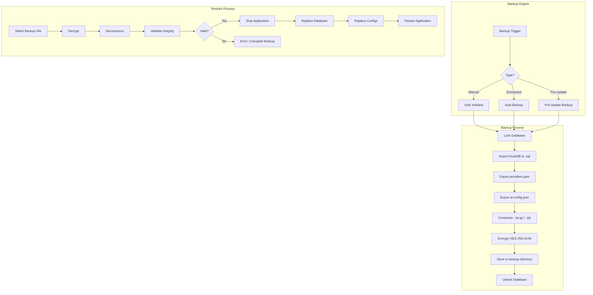

### 12.2 Backup Contents

| Component | Included | Format | Size Estimate |
|-----------|----------|--------|---------------|
| DuckDB Database | ✅ | SQL dump + .duckdb | Variable |
| Provider Config | ✅ | providers.json | < 10KB |
| AI Config | ✅ | ai-config.json | < 1KB |
| System Settings | ✅ | From database | < 10KB |
| User Preferences | ✅ | From database | < 10KB |
| Audit Logs | ✅ | From database | Variable |
| Uploaded Data | ✅ | From database | Variable |
| Frontend Build | ❌ | — | — |
| Source Code | ❌ | — | — |
| Environment | ❌ | — | — |

### 12.3 Backup File Format

**Naming Convention:**
```
tifai-backup-{workspace}-{date}-{time}-{checksum}.tifbak
Example: tifai-backup-default-20260707-120000-a1b2c3.tifbak
```

**Internal Structure (ZIP):**
```
tifai-backup/
├── manifest.json              # Backup metadata (version, date, checksums)
├── database.sql               # DuckDB SQL dump
├── providers.enc              # Encrypted providers.json
├── config.json                # ai-config.json copy
├── system_settings.json       # System settings export
└── audit_log.csv              # Audit log export (optional, configurable)
```

### 12.4 Compression & Encryption

| Step | Algorithm | Details |
|------|-----------|---------|
| Compression | gzip (tar) or ZIP | Automatic, configurable |
| Encryption | AES-256-GCM | Same key management as API keys |
| Key Derivation | PBKDF2 with 100,000 iterations | From user-provided passphrase |
| Integrity | SHA-256 checksum per file | Included in manifest |

### 12.5 Backup Schedule

| Schedule | Default | Description |
|----------|---------|-------------|
| Manual | On demand | User-initiated backup |
| Daily | Disabled | Once per day at specified time |
| Weekly | Disabled | Every Sunday at 02:00 |
| Monthly | Disabled | First day of month at 02:00 |
| Pre-Update | Always | Auto-backup before system update |

### 12.6 Retention Policy

| Backup Type | Retention | Auto-Cleanup |
|-------------|-----------|--------------|
| Manual | Forever (until deleted) | No |
| Daily | 7 days | Oldest deleted |
| Weekly | 4 weeks | Oldest deleted |
| Monthly | 12 months | Oldest deleted |
| Pre-Update | 2 most recent | Oldest deleted |

### 12.7 Restore Process

**Steps:**
1. User navigates to Settings → Backup & Restore
2. Selects backup file from list or uploads `.tifbak` file
3. System validates backup integrity (checksum check)
4. User confirms restore (with warning: "This will replace all current data")
5. System stops accepting new requests
6. Decrypts and decompresses backup
7. Replaces database and configuration files
8. Verifies restore integrity
9. Restarts application services
10. User receives confirmation

### 12.8 Verification

| Check | Method | On Create | On Restore |
|-------|--------|-----------|------------|
| File Integrity | SHA-256 checksum | ✅ | ✅ |
| SQL Syntax | Parse dump | ✅ | ❌ |
| Table Count | Compare | ❌ | ✅ |
| Row Count | Compare | ❌ | ✅ |
| Schema Match | Compare columns | ❌ | ✅ |

### 12.9 UI Wireframe (Proposed)

```
┌──────────────────────────────────────────────────────────────┐
│  Backup & Restore                                            │
├──────────────────────────────────────────────────────────────┤
│  ┌────────────────────────────────────────────────────────┐  │
│  │  [Create Backup]  [Auto Backup: OFF ▼]  [⚙️ Schedule]  │  │
│  └────────────────────────────────────────────────────────┘  │
│                                                              │
│  Backup History:                                              │
│  ┌───────────────────────┬──────────┬────────┬──────────┐    │
│  │ File                  │ Date     │ Size   │ Action   │    │
│  ├───────────────────────┼──────────┼────────┼──────────┤    │
│  │ tifai-backup-default… │ Jul 7    │ 2.4 MB │ [↻][🗑]  │    │
│  │ tifai-backup-default… │ Jul 6    │ 2.3 MB │ [↻][🗑]  │    │
│  │ tifai-backup-default… │ Jul 5    │ 2.3 MB │ [↻][🗑]  │    │
│  └───────────────────────┴──────────┴────────┴──────────┘    │
│                                                              │
│  ┌────────────────────────────────────────────────────────┐  │
│  │  ⚠️ Restore will replace ALL current data with the      │  │
│  │  selected backup. This action cannot be undone.         │  │
│  │                                                        │  │
│  │  [Upload Backup]  [Restore Selected]  [Cancel]          │  │
│  └────────────────────────────────────────────────────────┘  │
└──────────────────────────────────────────────────────────────┘
```

---

# Part IX — Development Rules

---

## 13. Development Rules

### 13.1 Hard Rules (Cannot Be Violated)

| # | Rule | Consequence |
|---|------|-------------|
| R01 | No more than **one** major feature per task | Task rejected |
| R02 | No architecture changes without documented review | Reverted |
| R03 | Full compliance with Design System (Part V) | Code review fail |
| R04 | Full compliance with Business Logic (Part III) | Code review fail |
| R05 | Every change must update this document | PR not merged |
| R06 | No removal of any function without documenting the reason | PR not merged |
| R07 | All new code must be bilingual (en/ar) capable | Code review fail |
| R08 | All new UI must support light AND dark themes | Code review fail |
| R09 | All new components must be keyboard accessible | Code review fail |
| R10 | No hardcoded secrets, keys, or passwords | Security review fail |

### 13.2 Soft Rules (Strongly Recommended)

| # | Rule | Rationale |
|---|------|-----------|
| S01 | Prefer composition over inheritance | Maintainability |
| S02 | One component = one file | Discoverability |
| S03 | Keep functions under 50 lines | Readability |
| S04 | Use TypeScript strict mode | Type safety |
| S05 | Write tests before implementation (TDD preferred) | Quality |
| S06 | Commit messages follow conventional commits | History clarity |
| S07 | Branch per feature, delete after merge | Clean repo |

### 13.3 Workflow

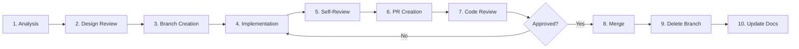

### 13.4 Commit Message Convention

```
<type>(<scope>): <description>

[optional body]

[optional footer]
```

**Types:** `feat`, `fix`, `docs`, `style`, `refactor`, `test`, `chore`, `perf`, `security`

**Scope Examples:** `dashboard`, `inventory`, `forecast`, `settings`, `auth`, `api`, `ui`, `docs`

**Examples:**
```
feat(dashboard): add executive summary KPI card
fix(inventory): handle zero-stock edge case in status calc
docs(bible): update AI provider section with Groq
```

### 13.5 Branch Strategy

| Branch | Purpose | Base | Deleted After |
|--------|---------|------|---------------|
| `main` | Production-ready | — | Never |
| `develop` | Integration branch | `main` | Never |
| `feature/*` | New features | `develop` | Merge |
| `fix/*` | Bug fixes | `develop` | Merge |
| `release/*` | Release preparation | `develop` | Merge |

---

# Part X — Coding Standards

---

## 14. Coding Standards

### 14.1 Python (Backend)

| Aspect | Standard |
|--------|----------|
| Line Length | 88 characters (Black default) |
| Indentation | 4 spaces |
| Quotes | Double quotes (`"`) |
| Type Hints | Required on all function signatures |
| Imports | `stdlib → third-party → local` (alphabetical within groups) |
| Naming | `snake_case` for functions/vars, `PascalCase` for classes, `UPPER_CASE` for constants |
| Docstrings | Google style (triple double quotes) |
| Max Function Lines | 50 (excluding docstring) |
| Max Class Lines | 200 |
| Linter | Ruff (all rules enabled by default) |
| Formatter | Black |

**Example:**
```python
from typing import Optional

import pandas as pd
from pydantic import BaseModel

from app.core.config import settings


def calculate_inventory_turns(
    total_cogs: float,
    avg_inventory_value: float,
) -> float:
    """Calculate inventory turnover ratio.

    Args:
        total_cogs: Total cost of goods sold.
        avg_inventory_value: Average inventory value.

    Returns:
        The inventory turnover ratio, or 0 if avg_inventory_value is 0.
    """
    if avg_inventory_value == 0:
        return 0.0
    return total_cogs / avg_inventory_value
```

### 14.2 TypeScript / React (Frontend)

| Aspect | Standard |
|--------|----------|
| Line Length | 100 characters |
| Indentation | 2 spaces |
| Quotes | Single quotes (`'`) |
| Semicolons | Required |
| Naming | `camelCase` for functions/vars, `PascalCase` for components/types, `UPPER_CASE` for constants |
| Props Interface | Required for all components |
| Exports | Named exports preferred |
| Max Component Lines | 150 |
| Linter | ESLint with TypeScript plugin |
| Formatter | Prettier |

**Example:**
```tsx
import React, { useState } from 'react';
import { useTranslation } from 'react-i18next';
import type { KPIItem } from '../types';

interface KpiCardProps {
  item: KPIItem;
  onClick?: (item: KPIItem) => void;
}

export const KpiCard: React.FC<KpiCardProps> = ({ item, onClick }) => {
  const { t } = useTranslation();

  return (
    <div className="kpi-card" onClick={() => onClick?.(item)} role="button" tabIndex={0}>
      <h3 className="kpi-card__title">{t(`kpi_name_${item.name}`)}</h3>
      <p className="kpi-card__value">{item.value.toLocaleString()}</p>
      <span className={`kpi-card__trend kpi-card__trend--${item.trend}`}>
        {item.trend === 'up' ? '▲' : item.trend === 'down' ? '▼' : '◆'}
      </span>
    </div>
  );
};
```

### 14.3 Folder & File Organization

**Backend:**
```
app/
├── api/          # Route handlers (thin controllers)
├── core/         # Configuration, settings, utilities
├── data/         # Database access, storage layer
├── schemas/      # Pydantic models (request/response)
└── services/     # Business logic (skills, agents, AI)
```

**Frontend:**
```
src/
├── components/   # Reusable UI components
├── pages/        # Page-level components (one per route)
├── context/      # React context providers
├── services/     # API client, provider configs
├── locales/      # i18n JSON files
├── hooks/        # Custom React hooks (proposed)
├── types/        # TypeScript type definitions (proposed)
├── utils/        # Utility functions (proposed)
└── theme/        # CSS theme variables
```

### 14.4 Service Layer Rules

| Rule | Description |
|------|-------------|
| Skills are stateless | Pure functions — given input, produce output |
| Agents orchestrate | Agents call skills, translate, log, never compute directly |
| API is thin | Routes parse params, call agents, return JSON |
| Schemas validate | Pydantic models at boundaries |
| DB is abstracted | All database access through `db.py` functions |

### 14.5 Error Handling

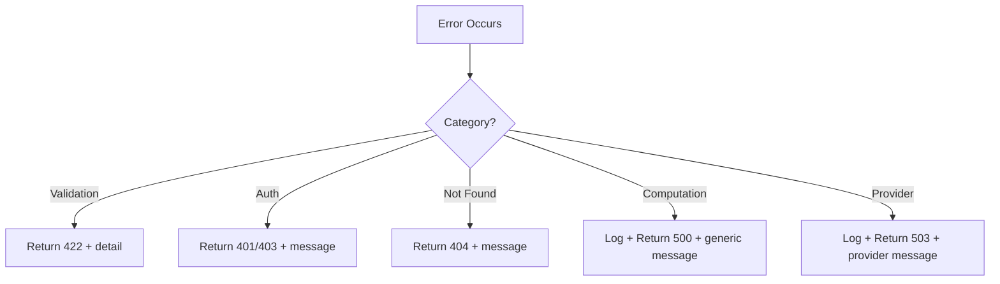

**Backend Error Response Format:**
```json
{
  "error": true,
  "code": "VALIDATION_ERROR",
  "message": "Invalid date format. Expected YYYY-MM-DD.",
  "details": {
    "field": "start_date",
    "value": "01-01-2025"
  }
}
```

### 14.6 Logging Standards

| Level | Usage | Backend | Frontend |
|-------|-------|---------|----------|
| DEBUG | Development details | `logger.debug()` | `console.debug()` |
| INFO | Business events | `logger.info()` | `console.info()` |
| WARNING | Recoverable issues | `logger.warning()` | `console.warn()` |
| ERROR | Failed operations | `logger.error()` | `console.error()` |
| CRITICAL | System down | `logger.critical()` | — |

**Backend format:** JSON structured logging via `app/core/logging.py`

### 14.7 Testing Standards

| Aspect | Standard |
|--------|----------|
| Test Framework | pytest (backend), Jest + React Testing Library (frontend) |
| File Naming | `test_<module>.py`, `<Component>.test.tsx` |
| Coverage Target | >= 80% per module |
| Test Types | Unit, Integration, API (not E2E in CI) |
| Fixtures | `conftest.py` for shared fixtures |
| Mocking | Prefer `unittest.mock` over monkey-patching |
| Async | `pytest-asyncio` for async tests |

---

# Part XI — Phase Execution Plan

---

## 15. Phase Execution Plan

### 15.1 Phase Overview

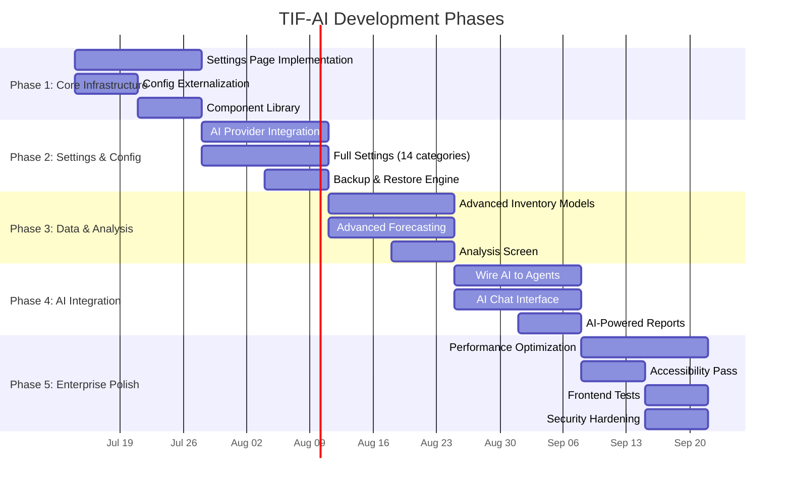

### 15.2 Phase 1: Core Infrastructure (Week 1–2)

**Goal:** Establish configurable, maintainable foundation.

| Task | Affected Files | New Files | Effort |
|------|---------------|-----------|--------|
| Externalize all hardcoded thresholds | `app/services/skills.py`, `app/schemas/*.py` | `config/analysis-config.yaml` | 2d |
| Extract CSS into component-based structure | `frontend/src/App.css`, `frontend/src/index.css` | `frontend/src/components/*/*.css` | 3d |
| Build component library (Button, Card, Table, Modal, Input) | — | `frontend/src/components/ui/` (5–10 files) | 4d |
| Implement error boundaries | `frontend/src/App.tsx` | `frontend/src/components/ErrorBoundary.tsx` | 1d |
| Skeleton loading components | — | `frontend/src/components/Skeleton.tsx` | 1d |
| Frontend folder restructure (hooks/, types/, utils/) | Various imports | `frontend/src/hooks/`, `frontend/src/types/` | 2d |
| Add frontend tests | — | 10+ test files | 3d |

**Definition of Done:**
- All thresholds configurable via `analysis-config.yaml`
- CSS split into component files, no monolithic App.css
- 5+ reusable UI components with props interfaces
- Error boundaries on all 7 pages
- Skeleton loading on async data
- Frontend test suite with 50+ tests

**Rollback Plan:** Revert to previous commit; restore `App.css` backup.

### 15.3 Phase 2: Settings & Configuration (Week 3–4)

**Goal:** Full settings page with all 14 categories.

| Task | Affected Files | New Files | Effort |
|------|---------------|-----------|--------|
| Settings page UI (14 categories) | `frontend/src/pages/SettingsPage.tsx` | — | 4d |
| Settings API endpoints | `app/api/api.py` | — | 2d |
| Settings store in DuckDB | `app/data/db.py` | — | 1d |
| AI provider full integration | `app/services/ai_provider.py` | — | 3d |
| Backup & restore engine | — | `app/services/backup.py` | 3d |
| Backup API endpoints | — | `app/api/backup.py` | 2d |
| Notification settings | — | — | 1d |
| Workspace management | — | — | 2d |

**Definition of Done:**
- All 14 settings categories functional
- Settings persist across page refreshes
- AI provider connection testing works
- Backup creation and restore workflow verified
- Notifications configurable per type

**Rollback Plan:** Revert settings store changes; keep old `providers.json` format.

### 15.4 Phase 3: Data & Analysis (Week 5–7)

**Goal:** Advanced analytics beyond MVP.

| Task | Affected Files | New Files | Effort |
|------|---------------|-----------|--------|
| Safety stock calculation | `app/services/skills.py` | — | 2d |
| Reorder point calculation | `app/services/skills.py` | — | 1d |
| EOQ calculation | `app/services/skills.py` | — | 2d |
| ABC analysis | `app/services/skills.py` | — | 3d |
| XYZ analysis | `app/services/skills.py` | — | 2d |
| FSN analysis | `app/services/skills.py` | — | 2d |
| Upload page | — | `frontend/src/pages/UploadPage.tsx` | 3d |
| Analysis page with tabs | — | `frontend/src/pages/AnalysisPage.tsx` | 3d |
| Reports page | — | `frontend/src/pages/ReportsPage.tsx` | 3d |

**Definition of Done:**
- Safety stock, ROP, EOQ calculated per product
- ABC, XYZ, FSN classifications working
- Upload page validates and imports CSV
- Analysis page with Summary/Details/AI tabs
- Reports page with generate + schedule

**Rollback Plan:** New skills added as separate functions; old skills unchanged.

### 15.5 Phase 4: AI Integration (Week 8–9)

**Goal:** Wire AI providers to generate narrative insights.

| Task | Affected Files | New Files | Effort |
|------|---------------|-----------|--------|
| Wire AI to Dashboard agent | `app/services/agents.py` | — | 2d |
| Prompt template system | — | `app/services/prompts/` | 3d |
| AI Chat page | — | `frontend/src/pages/AiChatPage.tsx` | 4d |
| AI-powered reports | `app/services/agents.py` | — | 2d |
| Response parsing & fallback | — | `app/services/response_parser.py` | 2d |
| AI provider fallback chain | `app/services/ai_provider.py` | — | 1d |

**Definition of Done:**
- Dashboard shows AI-generated narrative when provider is active
- AI Chat answers natural language questions about inventory
- Reports include AI commentary section
- Graceful fallback to template text when AI unavailable
- All 13 providers properly wired (not just 3)

**Rollback Plan:** AI wiring toggle in settings; default OFF for transition.

### 15.6 Phase 5: Enterprise Polish (Week 10)

**Goal:** Production readiness.

| Task | Affected Files | Effort |
|------|---------------|--------|
| Performance profiling & optimization | All | 3d |
| Bundle size reduction | `frontend/` | 2d |
| Lighthouse audit (target 90+) | `frontend/` | 1d |
| Accessibility audit (WCAG AA) | All UI | 2d |
| Security audit | Backend | 2d |
| Rate limiting | `app/api/api.py` | 1d |
| CORS hardening | `app/main.py` | 0.5d |
| Final documentation update | `TIF_AI_EXECUTION_BIBLE.md` | 1d |
| Load testing | Backend | 1d |

**Definition of Done:**
- Lighthouse: Performance ≥ 90, Accessibility ≥ 90, Best Practices ≥ 90
- Bundle size < 500KB (gzipped)
- API p95 response time < 300ms
- All WCAG 2.1 AA criteria met
- No security warnings from dependency scan
- Rate limiting active (100 req/min per user)

---

# Part XII — Testing Strategy

---

## 16. Testing Strategy

### 16.1 Test Pyramid

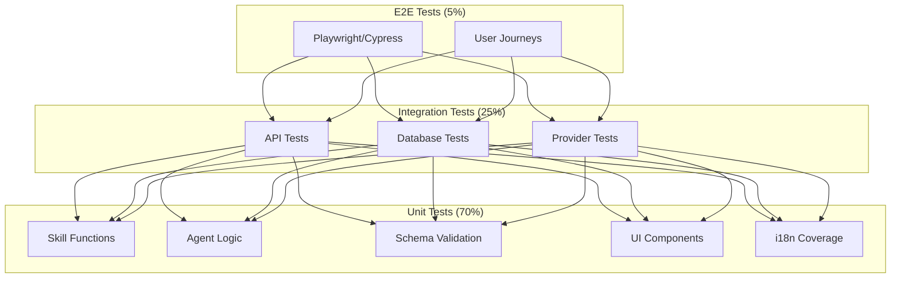

### 16.2 Current Coverage

| Layer | Tests | Framework | Coverage |
|-------|-------|-----------|----------|
| Skills | 15+ | pytest | Functions: 70% |
| Agents | 10+ | pytest | Lines: 60% |
| API | 25+ | pytest + TestClient | Endpoints: 80% |
| Auth | 8+ | pytest | Lines: 85% |
| DB | 10+ | pytest | Lines: 65% |
| Schemas | 7+ | pytest | Models: 90% |
| Frontend | 0 | Jest + RTL | Components: 0% |
| **Total** | **75** | — | **Average: 50%** |

### 16.3 Target Coverage (End of Phase 5)

| Layer | Target Tests | Target Coverage |
|-------|-------------|-----------------|
| Skills | 30+ | 95% |
| Agents | 20+ | 90% |
| API | 35+ | 95% |
| Auth | 12+ | 95% |
| DB | 15+ | 85% |
| Schemas | 10+ | 100% |
| Frontend (Unit) | 50+ | 80% |
| Frontend (Integration) | 20+ | 70% |
| E2E | 10+ | Key journeys |
| **Total** | **200+** | **Average: 85%** |

### 16.4 Test Types

#### 16.4.1 Unit Tests

| Module | What to Test | Example |
|--------|-------------|---------|
| Skills | Each function with known inputs/outputs | `calculate_kpis(sample_data) → expected KPI values` |
| Schemas | Validation rules, edge cases | `InventoryItem(status="invalid") → ValidationError` |
| UI Components | Render, props, user interaction | `KpiCard renders value, handles click` |
| i18n | All keys present in both locales | `ar.json has same keys as en.json` |

#### 16.4.2 Integration Tests

| Module | What to Test | Example |
|--------|-------------|---------|
| API | Each endpoint returns correct status + shape | `GET /api/v1/dashboard → 200 + DashboardAnalyzeResponse` |
| Database | CRUD operations | `create_product → read_product → same data` |
| Agents | Agent calls correct skill, logs correctly | `DashboardAgent.analyze() → audit_log has entry` |
| AI Provider | Connection test with mock server | `test_connection(valid_key) → True` |

#### 16.4.3 E2E Tests (Phase 5)

| Journey | Steps | Tool |
|---------|-------|------|
| Login → Dashboard | Login, see KPIs, apply filter | Playwright |
| Inventory CRUD | Create, read, update, delete product | Playwright |
| Forecast Flow | Select period, run forecast, view results | Playwright |
| Settings Save | Change provider, test, save | Playwright |
| Language Switch | Toggle ar/en, verify translated | Playwright |

#### 16.4.4 Performance Tests

| Test | Target | Tool |
|------|--------|------|
| API response time | p95 < 300ms | locust / k6 |
| Dashboard load | < 1.5s FCP | Lighthouse |
| Concurrent users | 50 simultaneous | locust |
| Data import (10K rows) | < 5s | Custom script |

### 16.5 Test Fixtures

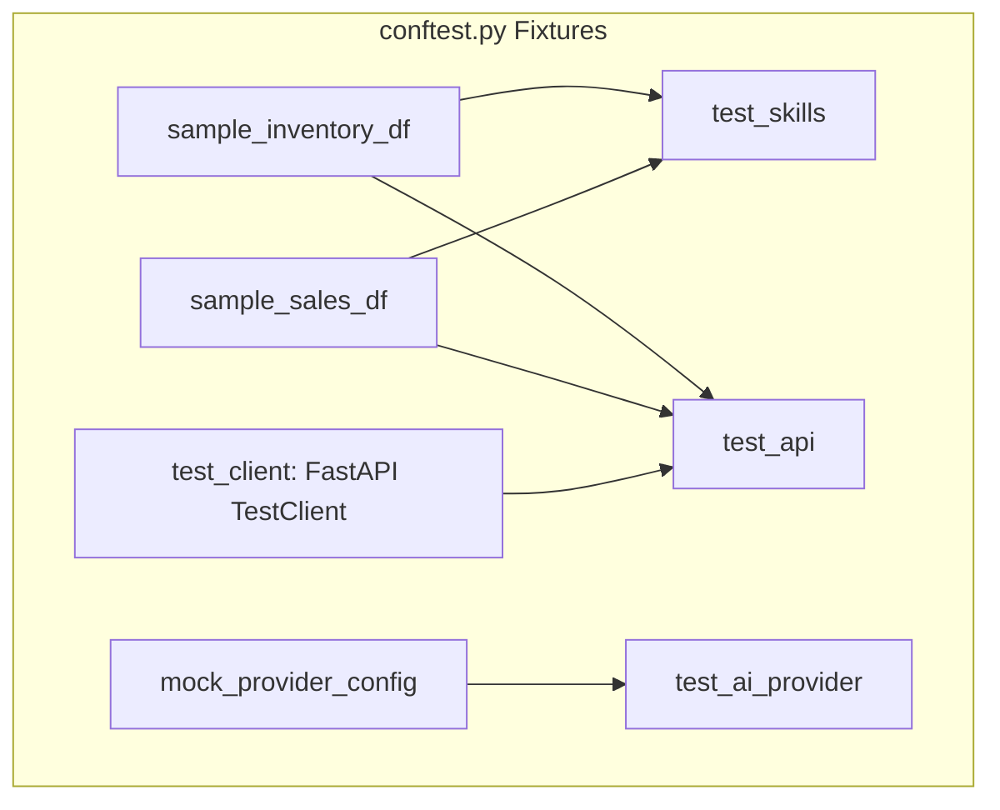

### 16.6 Running Tests

| Command | Scope | When |
|---------|-------|------|
| `python -m pytest tests/ -v` | All backend tests | Before commit |
| `python -m pytest tests/test_skills.py -v` | Skills only | During dev |
| `python -m pytest tests/ --cov=app` | With coverage | CI pipeline |
| `npm test -- --coverage` | Frontend tests | Before merge |
| `npx playwright test` | E2E tests | Before release |

### 16.7 Regression Prevention

- Every bug fix includes a test that reproduces the bug
- Every new feature includes tests for all acceptance criteria
- API changes verified via schema validation tests
- i18n changes verified both locale files have identical keys

# Part XIII — Quality Gates

---

## 17. Quality Gates

### 17.1 Gate Checklist

No phase, feature, or fix is considered complete until ALL of the following are verified:

| # | Gate | Check | Criticality |
|---|------|-------|-------------|
| Q01 | Build | Backend: `python -m pytest tests/` passes | 🔴 Blocking |
| Q02 | Build | Frontend: `npm run build` succeeds | 🔴 Blocking |
| Q03 | Lint | No lint errors (Ruff/ESLint) | 🔴 Blocking |
| Q04 | Types | No TypeScript errors (`tsc --noEmit`) | 🔴 Blocking |
| Q05 | Tests | All tests pass (backend + frontend) | 🔴 Blocking |
| Q06 | Coverage | No reduction in test coverage | 🟡 Warning |
| Q07 | Bilingual | All new UI text has en + ar translations | 🔴 Blocking |
| Q08 | Theme | All new UI renders correctly in light + dark | 🟡 Warning |
| Q09 | RTL/LTR | Layout correct in both directions | 🔴 Blocking |
| Q10 | Responsive | Works at 1024px+ (mobile: 320px+ for Phase 5) | 🟡 Warning |
| Q11 | Keyboard | All interactive elements keyboard-accessible | 🔴 Blocking |
| Q12 | Docs | This document updated with any changes | 🔴 Blocking |
| Q13 | Business Logic | Formulas match Part III specification | 🔴 Blocking |
| Q14 | Design System | Colors, spacing, typography match Part V | 🟡 Warning |
| Q15 | No Warnings | No unjustified warnings in build output | 🟡 Warning |
| Q16 | Security | No secrets committed, no new vulnerability | 🔴 Blocking |
| Q17 | Performance | No regression in p95 response time | 🟡 Warning |
| Q18 | Audit Log | All new actions logged appropriately | 🔴 Blocking |

### 17.2 Phase Completion Certification

```
PHASE COMPLETION CERTIFICATE
━━━━━━━━━━━━━━━━━━━━━━━━━━━━━━━━━━━━━━━

Phase: [Phase Name]
Date:   [YYYY-MM-DD]
Lead:   [Name]

Quality Gates:
  ☐ Q01 Build (Backend tests)         ☐ Q10 Responsive
  ☐ Q02 Build (Frontend build)        ☐ Q11 Keyboard
  ☐ Q03 Lint                          ☐ Q12 Docs updated
  ☐ Q04 Types                         ☐ Q13 Business Logic
  ☐ Q05 All tests pass                ☐ Q14 Design System
  ☐ Q06 Coverage maintained           ☐ Q15 No warnings
  ☐ Q07 Bilingual                     ☐ Q16 Security
  ☐ Q08 Light + Dark                  ☐ Q17 Performance
  ☐ Q09 RTL/LTR                       ☐ Q18 Audit Log

All gates passed: ☐ Yes / ☐ No

Signatures:
  Technical Lead: _______________
  QA Lead:        _______________
  Product Owner:  _______________
```

---

# Part XIV — Risk Analysis

---

## 18. Risk Analysis

### 18.1 Risk Register

| ID | Risk | Probability | Impact | Score | Mitigation | Contingency |
|----|------|-------------|--------|-------|------------|-------------|
| RSK-01 | AI provider API changes break integration | Medium | High | High | Provider abstraction with adapter pattern | Fallback to template mode |
| RSK-02 | DuckDB performance degrades at scale | Medium | Medium | Medium | Indexes, caching, query optimization | Migrate to PostgreSQL |
| RSK-03 | Hardcoded JWT secret compromises auth | High | Critical | Critical | Externalize to env var immediately | Force password reset |
| RSK-04 | Bilingual UI inconsistencies in RTL | Medium | Medium | Medium | Automated RTL visual tests | Manual QA pass |
| RSK-05 | Frontend bundle size grows unbounded | Medium | Medium | Medium | Code splitting, lazy loading | Tree-shaking audit |
| RSK-06 | CSV data quality issues (bad rows) | High | Medium | High | Validation before import, quality report | Manual data correction |
| RSK-07 | Browser compatibility (older browsers) | Low | Medium | Low | Target modern browsers (last 2 versions) | Polyfill service |
| RSK-08 | No offline capability | Low | Medium | Low | — | Accept limitation |
| RSK-09 | Dependency supply chain attack | Low | Critical | Medium | Lock files, Dependabot, SCA scanning | Pin versions |
| RSK-10 | Scope creep delaying releases | High | High | High | Strict feature freeze, change control | Deferred to next phase |
| RSK-11 | Developer unfamiliarity with DuckDB | Medium | Low | Low | Documentation, examples | Training session |
| RSK-12 | Arabic NLP quality from AI providers | Medium | Medium | Medium | Test with Arabic prompts | Template fallback |

### 18.2 Phase-Specific Risks

| Phase | Risk | Likelihood | Impact |
|-------|------|------------|--------|
| P1: Core Infrastructure | CSS refactoring breaks existing layouts | High | High |
| P2: Settings & Config | Settings store migration loses user configs | Medium | High |
| P3: Data & Analysis | Advanced model complexity exceeds estimates | Medium | Medium |
| P4: AI Integration | Provider response parsing failures | Medium | Medium |
| P5: Enterprise Polish | Lighthouse score target not achievable | Low | Medium |

### 18.3 Risk Response Strategy

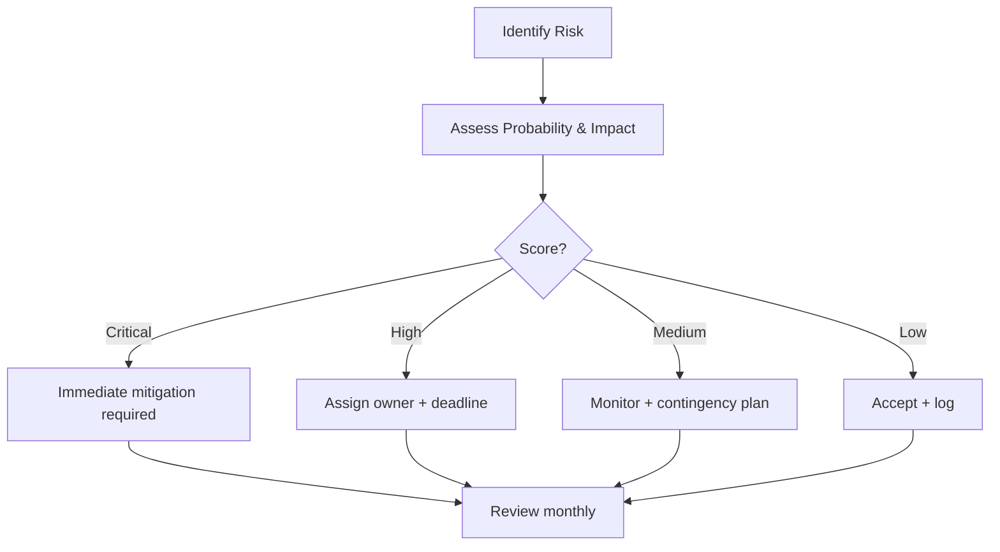

---

# Part XV — Technical Debt

---

## 19. Technical Debt

### 19.1 Debt Register

| ID | Item | Type | Severity | Effort | Status | Phase to Fix |
|----|------|------|----------|--------|--------|-------------|
| TD-01 | Hardcoded JWT secret in config.py | Security | Critical | 1h | ❌ Open | P1 |
| TD-02 | Hardcoded business thresholds in skills.py | Maintainability | High | 4h | ❌ Open | P1 |
| TD-03 | Monolithic App.css (309 lines) | Maintainability | High | 8h | ❌ Open | P1 |
| TD-04 | No component library (raw HTML elements) | Maintainability | High | 16h | ❌ Open | P1 |
| TD-05 | No error boundaries in frontend | Reliability | High | 4h | ❌ Open | P1 |
| TD-06 | No skeleton loading states | UX | Medium | 8h | ❌ Open | P1 |
| TD-07 | Frontend has 0 tests | Quality | Critical | 24h | ❌ Open | P5 |
| TD-08 | No CORS configuration | Security | Medium | 1h | ❌ Open | P5 |
| TD-09 | No rate limiting | Security | Medium | 4h | ❌ Open | P5 |
| TD-10 | i18n keys duplicated (frontend 85 + backend 38) | Maintainability | Medium | 4h | ❌ Open | P2 |
| TD-11 | Inline types instead of shared schemas | Maintainability | Low | 4h | ❌ Open | P1 |
| TD-12 | No loading states on Settings page | UX | Low | 2h | ❌ Open | P1 |
| TD-13 | Duplicate date logic in multiple components | Maintainability | Low | 2h | ❌ Open | P1 |
| TD-14 | AI providers not wired to agents | Feature Gap | High | 16h | ❌ Open | P4 |
| TD-15 | COGS approximation (uses avg_cost) | Accuracy | Medium | 4h | ❌ Open | P3 |
| TD-16 | Trend calculation returns "stable" always | Accuracy | Medium | 4h | ❌ Open | P3 |
| TD-17 | Direct fetch() without interceptor | Maintainability | Low | 4h | ❌ Open | P1 |

### 19.2 Debt Priority Ranking

| Priority | ID | Rationale |
|----------|----|-----------|
| P0 (Fix immediately) | TD-01, TD-08, TD-09 | Security vulnerabilities |
| P1 (Fix in current phase) | TD-02, TD-03, TD-04, TD-05, TD-06, TD-11, TD-12, TD-13, TD-17 | Block maintainability & UX |
| P2 (Fix in next phase) | TD-10, TD-15, TD-16 | Accuracy & consistency |
| P3 (Plan for future) | TD-07, TD-14 | Large effort, high value |

### 19.3 Debt Prevention Rules

1. **No new hardcoded values** — all thresholds in config files
2. **No new monolithic CSS** — component-scoped styles only
3. **Every new component gets a test** — minimum smoke test
4. **Every new feature gets error handling** — error boundary or try/catch
5. **No new direct fetch()** — use a centralized API client
6. **Bilingual by default** — never hardcode display strings

---

# Part XVI — Future Roadmap

---

## 20. Future Roadmap

### 20.1 Version Roadmap

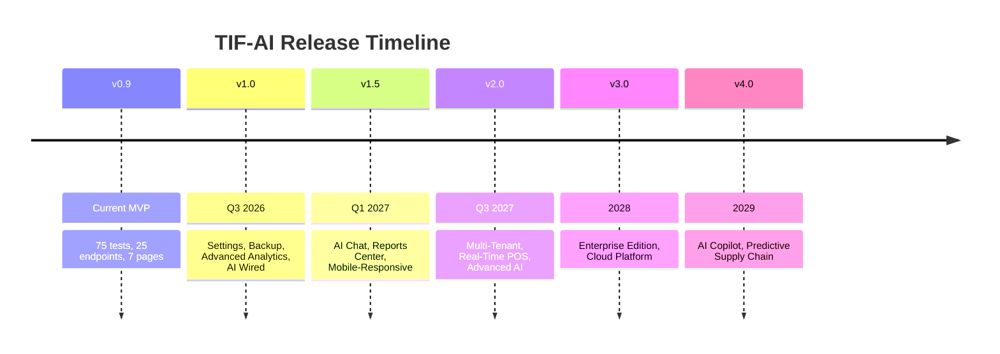

### 20.2 Version Details

#### v1.0 — "Foundation" (Target: Q3 2026)

| Feature | Description | Status |
|---------|-------------|--------|
| Full Settings Page | 14 categories with persistence | Planned |
| Backup & Restore | Encrypted backups with scheduling | Planned |
| Advanced Inventory | ABC, XYZ, FSN, Safety Stock, ROP, EOQ | Planned |
| Upload Page | CSV data import with validation | Planned |
| Analysis Page | Tabbed deep-dive view | Planned |
| Reports Page | Generate + schedule reports | Planned |
| AI Narrative | Wire providers to agents | Planned |
| Component Library | Button, Card, Table, Modal, Input | Planned |

#### v1.5 — "Intelligence" (Target: Q1 2027)

| Feature | Description |
|---------|-------------|
| AI Chat Assistant | Natural language Q&A about inventory |
| Reports Center | PDF export, scheduled email reports |
| Mobile-Responsive | Full support for tablets and phones |
| Notification Center | In-app + email alert management |
| Prompt Library | Saved AI prompt templates |
| Enhanced Forecasting | Model selection (ARIMA, Prophet) |

#### v2.0 — "Scale" (Target: Q3 2027)

| Feature | Description |
|---------|-------------|
| Multi-Tenant | Isolated workspaces per organization |
| Real-Time POS Integration | Live sales data streaming |
| Advanced AI | RAG-powered analysis with context |
| Supplier Performance | Lead time and reliability scoring |
| Demand Sensing | Real-time demand pattern detection |
| Price Elasticity | Demand sensitivity analysis |

#### v3.0+ — "Enterprise / Cloud" (Future)

| Edition | Features |
|---------|----------|
| Enterprise | On-premise, SSO, LDAP, custom branding, SLA support |
| Cloud | SaaS multi-tenant, managed hosting, auto-scaling |
| AI Copilot | Proactive recommendations, anomaly prediction, auto-reordering |

### 20.3 Feature Comparison by Edition

| Feature | Free | Pro | Enterprise | Cloud |
|---------|------|-----|------------|-------|
| Dashboard | ✅ | ✅ | ✅ | ✅ |
| Inventory Analytics | ✅ | ✅ | ✅ | ✅ |
| Forecasting | Basic | Advanced | Advanced + AI | Advanced + AI |
| AI Insights | ❌ | ✅ | ✅ | ✅ |
| AI Chat | ❌ | ❌ | ✅ | ✅ |
| Reports | CSV/Excel | + PDF | + Scheduled | + Scheduled |
| Users | 3 | 10 | Unlimited | Per-seat |
| Workspaces | 1 | 3 | Unlimited | Per-org |
| Backup | Manual | Manual + Auto | Full DR | Managed |
| Support | Community | Email | Priority | 24/7 |

---

# Part XVII — Decision Log

---

## 21. Decision Log

### 21.1 Architecture Decision Records

#### ADR-001: DuckDB as Primary Database

| Field | Value |
|-------|-------|
| **Status** | ✅ Implemented |
| **Context** | Needed embedded analytics database with zero configuration |
| **Alternatives** | PostgreSQL (operational overhead), SQLite (limited analytics), MySQL (heavy) |
| **Decision** | DuckDB — embedded, columnar, SQL-based, zero-config |
| **Consequences** | + Fast analytics, + No server setup, — Not for high-concurrency OLTP |
| **Date** | 2026-01 |

#### ADR-002: FastAPI over Flask/Django

| Field | Value |
|-------|-------|
| **Status** | ✅ Implemented |
| **Context** | Needed async support, automatic OpenAPI docs, Pydantic integration |
| **Alternatives** | Flask (no async), Django (heavy for API-only), Starlette (raw) |
| **Decision** | FastAPI — native async, auto-docs, Pydantic validation |
| **Consequences** | + Performance, + Documentation, — Smaller ecosystem than Django |

#### ADR-003: React 19 with CRA

| Field | Value |
|-------|-------|
| **Status** | ✅ Implemented |
| **Context** | Needed modern SPA with TypeScript, component ecosystem |
| **Alternatives** | Next.js (SSR overhead), Vue (team unfamiliar), Svelte (small ecosystem) |
| **Decision** | React 19 + Create React App + TypeScript |
| **Consequences** | + Large ecosystem, + Team familiarity, — CRA build times, — No SSR |

#### ADR-004: AI Provider Abstraction over Direct SDK

| Field | Value |
|-------|-------|
| **Status** | ✅ Implemented |
| **Context** | Need to support multiple AI providers without code changes |
| **Alternatives** | Direct OpenAI SDK only (vendor lock-in), Multiple SDKs without abstraction (messy) |
| **Decision** | BaseAIProvider abstract class with factory pattern |
| **Consequences** | + 13 providers supported, + Easy to add new, — Slight abstraction overhead |

#### ADR-005: Skills as Stateless Functions

| Field | Value |
|-------|-------|
| **Status** | ✅ Implemented |
| **Context** | Business logic must be testable, composable, and independent of framework |
| **Alternatives** | Class-based services (stateful), Inline in API routes (untestable) |
| **Decision** | Pure functions in `skills.py` — input → output, no side effects |
| **Consequences** | + Highly testable, + Composable, + Reusable by agents and API |

#### ADR-006: Agents as Orchestrators

| Field | Value |
|-------|-------|
| **Status** | ✅ Implemented |
| **Context** | Need separation between business logic and orchestration (logging, translation, error handling) |
| **Alternatives** | Monolithic API routes (no separation), Direct skill calls from API (no audit) |
| **Decision** | Agent classes call skills, add metadata, log, translate |
| **Consequences** | + Clean separation, + Audit trail, + Translation layer, — Extra abstraction |

#### ADR-007: i18n via Dictionary (gettext Alternative)

| Field | Value |
|-------|-------|
| **Status** | ✅ Implemented |
| **Context** | Need simple translation system without compilation step |
| **Alternatives** | gettext (compilation needed), Babel (heavy), Crowdin (external service) |
| **Decision** | Python dict-based i18n with format-string interpolation |
| **Consequences** | + Simple, + No build step, + JSON-compatible, — Manual key management |

#### ADR-008: RBAC over Fine-Grained Permissions

| Field | Value |
|-------|-------|
| **Status** | ✅ Implemented |
| **Context** | Need user role separation without complex permission system |
| **Alternatives** | Casbin (complex), Custom permissions (over-engineering for MVP) |
| **Decision** | 3 roles: admin, manager, viewer + JWT tokens |
| **Consequences** | + Simple, + Easy to audit, — Not flexible for complex orgs |

#### ADR-009: CSS Variables over CSS-in-JS

| Field | Value |
|-------|-------|
| **Status** | ✅ Implemented |
| **Context** | Need theming (light/dark) without runtime CSS-in-JS overhead |
| **Alternatives** | styled-components (runtime cost), Tailwind (utility classes), Emotion (runtime) |
| **Decision** | CSS custom properties + data-theme attribute + traditional CSS files |
| **Consequences** | + Zero runtime cost, + Browser-native, — Lacks dynamic styling, — No type safety |

### 21.2 Pending Decisions

| ID | Decision | Options | Expected By | Owner |
|----|----------|---------|-------------|-------|
| ADR-010 | Migration to Next.js | Next.js / Remix / Stay with CRA | v2.0 | Frontend Lead |
| ADR-011 | State Management | React Context / Zustand / Redux / Jotai | v1.5 | Frontend Lead |
| ADR-012 | CSS Framework | CSS Modules / Tailwind / Styled Components / Vanilla | v1.0 | Frontend Lead |
| ADR-013 | Testing Framework (E2E) | Playwright / Cypress / Selenium | v1.5 | QA Lead |
| ADR-014 | Monitoring & Observability | Prometheus + Grafana / Sentry / Datadog | v2.0 | DevOps Lead |

### 21.3 Decision Log Template

```
#### ADR-NNN: [Title]

| Field | Value |
|-------|-------|
| **Status** | [Proposed / Accepted / Deprecated / Superseded] |
| **Context** | [Why this decision was needed] |
| **Alternatives** | [What else was considered] |
| **Decision** | [What was chosen] |
| **Consequences** | [+ Positive, — Negative] |
| **Date** | [YYYY-MM-DD] |
```

---

# Part XVIII — Living Document Rules

---

## 22. Living Document Rules

### 22.1 Governance

- This document is the **single source of truth** for all TIF-AI development
- It supersedes all prior documentation, including: Master Documentation, Product Requirements, UI/UX Design System, Development Master Plan, and Business Logic Specification
- No decision, design, or implementation is valid unless it can be traced to this document
- Any conflict between this document and prior docs is resolved in favor of this document

### 22.2 Update Rules

| Rule | Description |
|------|-------------|
| **Every feature** must be added to this document before or during implementation | No undocumented features |
| **Every change** must update the version history below | Traceable changes |
| **Every removed feature** must document the reason | No silent deletions |
| **Every architecture change** must update Part II (Architecture) | Architecture always current |
| **Every new formula** must update Part III (Business Logic) | Business logic always current |
| **Every new UI component** must update Part V (Design System) | Design system always current |
| **Every new setting** must update Part VI (Settings) | Settings always current |

### 22.3 Version History

| Version | Date | Author | Changes |
|---------|------|--------|---------|
| 1.0 | 2026-07-07 | TIF-AI System | Initial comprehensive Execution Bible — merged all 5 prior docs |

### 22.4 Update Process

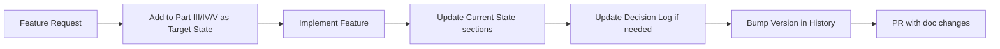

### 22.5 Document Health

| Metric | Target | Check Frequency |
|--------|--------|-----------------|
| Section count | 22 | Per release |
| All sections present | ✅ | Per commit |
| No broken anchors | ✅ | Per PR |
| Glossary up to date | Full coverage | Per feature |
| Version history accurate | Last 10 entries | Per release |

---

# Appendices

---

## A. Glossary

| Term | Definition |
|------|------------|
| **ABC Analysis** | Inventory classification by value (A=70%, B=20%, C=10%) |
| **Agent** | Orchestrator class that calls skill functions, translates output, and logs execution |
| **AI Provider** | External AI service (OpenAI, Gemini, Ollama, etc.) abstracted behind `BaseAIProvider` |
| **Anomaly** | Sales data point with \|z-score\| >= 2.5 |
| **Audit Log** | Database table recording all agent invocations |
| **COGS** | Cost of Goods Sold — approximated as `avg_cost × total_sales` |
| **Confidence** | Forecast reliability score (0.30–0.95) based on R² |
| **DuckDB** | Embedded columnar SQL database for analytics |
| **EOQ** | Economic Order Quantity — optimal order size `√(2DS/H)` |
| **FSN Analysis** | Classification by movement speed (Fast/Slow/Non-moving) |
| **Inventory Turnover** | COGS / average inventory value — measures how quickly stock sells |
| **JWT** | JSON Web Token — stateless authentication |
| **KPI** | Key Performance Indicator (sales qty, inventory value, turnover) |
| **Linear Regression** | Statistical method for forecasting `y = mx + b` |
| **Months of Stock** | `closing_stock / avg_daily_sales / 30` — supply coverage duration |
| **RBAC** | Role-Based Access Control (admin/manager/viewer) |
| **R² (R-squared)** | Coefficient of determination — forecast confidence metric |
| **ROP** | Reorder Point — `d_avg × lead_time + safety_stock` |
| **RTL** | Right-to-Left text direction (for Arabic) |
| **Safety Stock** | Buffer inventory against demand variability `Z × σ × √LT` |
| **Skill** | Pure function implementing a specific business logic calculation |
| **Transfer** | Recommended stock movement from surplus branch to deficit branch |
| **XYZ Analysis** | Classification by demand variability (X=stable, Y=variable, Z=erratic) |
| **Z-Score** | `(value - mean) / std` — statistical measure of deviation |

## B. Reference Index

### B1. File Index

| File | Purpose | Part/Section |
|------|---------|-------------|
| `app/main.py` | FastAPI entry point | 6.2 |
| `app/api/api.py` | All REST endpoints | 6.2.2 |
| `app/api/auth.py` | Auth routes | 6.2 |
| `app/core/config.py` | Settings, encryption | 6.4.2 |
| `app/core/logging.py` | JSON structured logging | 14.6 |
| `app/data/db.py` | DuckDB, CRUD, 6 tables | 6.4.1 |
| `app/data/settings_store.py` | Provider configs | 11.1 |
| `app/schemas/*.py` | 21 Pydantic models | 6.2.1 |
| `app/services/skills.py` | 7 core business functions | 7 |
| `app/services/agents.py` | 5 orchestration agents | 7.6 |
| `app/services/ai_provider.py` | Provider abstraction | 11.1 |
| `app/services/auth.py` | JWT, bcrypt, RBAC | 6.2 |
| `app/services/i18n.py` | Arabic translations (38 keys) | 6.2 |
| `app/services/notifications.py` | WebSocket + email | 6.2 |
| `frontend/src/App.tsx` | Router, navigation | 6.1 |
| `frontend/src/context/ThemeContext.tsx` | Theme + lang + RTL | 9.8 |
| `frontend/src/locales/*.json` | i18n (85 keys each) | 6.1 |
| `frontend/src/pages/*.tsx` | 7 page components | 6.1.1 |
| `frontend/src/theme/theme.css` | CSS custom properties | 9.2 |
| `config/ai-config.json` | Active AI provider | 11.3 |
| `data/providers.json` | 13 provider configs (encrypted) | 11.1 |
| `data/inventory_data.csv` | Sample inventory (25 rows) | 6.4.3 |
| `data/sales_data.csv` | Sample sales (312 rows) | 6.4.3 |

### B2. Decision Reference

| ADR | Decision | Section |
|-----|----------|---------|
| ADR-001 | DuckDB | 21.1 |
| ADR-002 | FastAPI | 21.1 |
| ADR-003 | React 19 + CRA | 21.1 |
| ADR-004 | AI Provider Abstraction | 21.1 |
| ADR-005 | Stateless Skills | 21.1 |
| ADR-006 | Agent Orchestration | 21.1 |
| ADR-007 | Dictionary i18n | 21.1 |
| ADR-008 | RBAC | 21.1 |
| ADR-009 | CSS Variables | 21.1 |

### B3. Formula Reference

| Formula | Location (Section) |
|---------|-------------------|
| Inventory Value = closing_stock × unit_cost | 7.2.2 |
| Inventory Turnover = COGS / avg_inventory_value | 7.2.2 |
| Months of Stock = closing_stock / max(avg_daily_sales, 0.01) / 30 | 7.2.1 |
| Z-Score = (value - mean) / std | 7.1.2 |
| Forecast: y = m × x + b (linear regression) | 7.3.1 |
| Confidence = max(0.30, min(0.95, R²)) | 7.3.1 |
| Transfer Qty = min(surplus, shortfall) | 7.4.1 |
| Safety Stock = Z × σ × √LT | 7.2.4 (future) |
| ROP = d_avg × LT + SS | 7.2.4 (future) |
| EOQ = √(2DS / H) | 7.2.4 (future) |

### B4. Threshold Reference

| Threshold | Value | Section |
|-----------|-------|---------|
| Anomaly Z-Score | ≥ 2.5 | 7.1.2 |
| Anomaly HIGH Severity | ≥ 3.0 | 7.1.2 |
| Overstock | months_of_stock ≥ 6 | 7.2.1 |
| Low Stock | months_of_stock < 3 | 7.2.1 |
| Out of Stock | closing_stock == 0 | 7.2.1 |
| Transfer Source | months_of_stock > 4 | 7.4.1 |
| Transfer Target | months_of_stock < 1 | 7.4.1 |
| Transfer HIGH Priority | target < 0.5 months | 7.4.1 |
| Forecast Confidence Cap | 0.95 | 7.3.1 |
| Forecast Confidence Floor | 0.30 | 7.3.1 |
| Low Turnover | inventory_turns < 2 | 7.8 |
| Zero Sales Fallback | avg_daily_sales = 0.01 | 7.2.1 |

---

> **End of TIF-AI Execution Bible**  
> *This document replaces all prior documentation and serves as the single source of truth.*  
> *Version: 1.0 | Last Updated: 2026-07-07*  
> *Next Review: 2026-10-07 or upon any architectural change*


